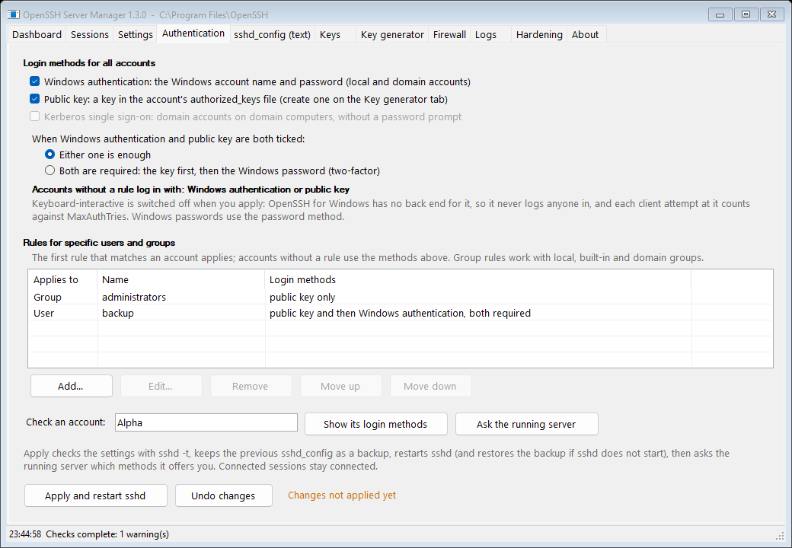
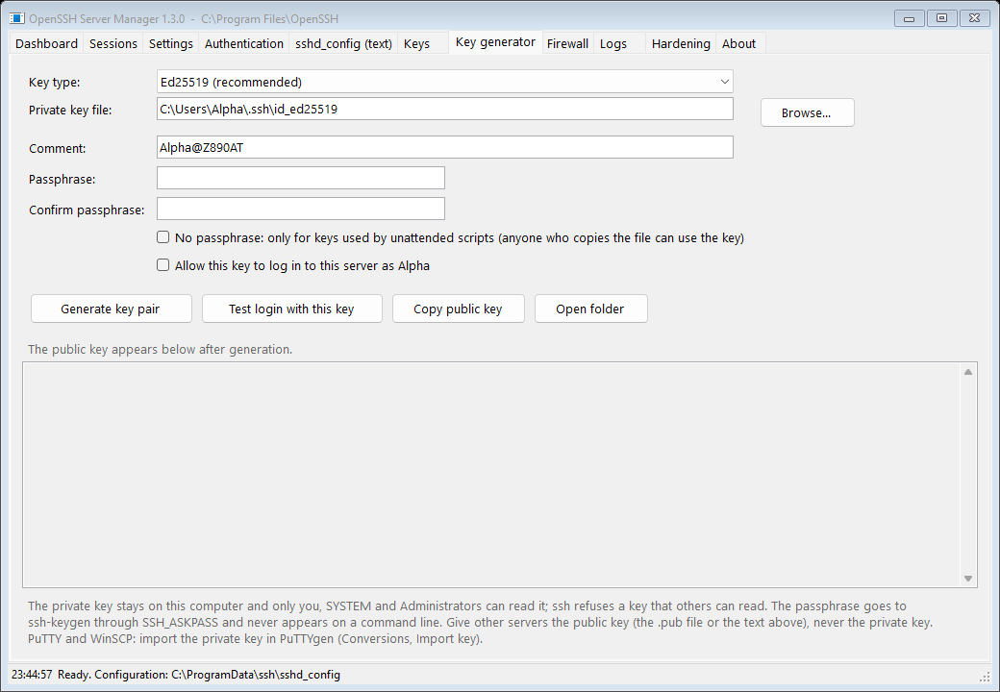

# OpenSSH Server PN

**OpenSSH Server PN** is an OpenSSH server and client for Windows with its own installer and a
management console. It builds on OpenSSH 10.5p1 and the Windows port of OpenSSH, and adds an
installer that cleans up whatever was installed before, a GUI with a setup wizard, a key-pair
generator and security checks, and a firewall rule that stays off public networks on Windows 10
and 11. Windows password logins stay on after installation, as in the official package, until
you have set up keys; the manager's setup wizard switches them off for administrators.

| Folder | Contents |
|---|---|
| `src/` | The server and client source: OpenSSH 10.5p1 with the Windows port, the vendored-library manifest (LibreSSL 4.3.2, libfido2 1.17.0) and the WiX installer. The repository history starts on 26 September 2026; the earlier history, with upstream OpenSSH's, is kept outside the repository for merging new OpenSSH releases ([BUILDING.md](docs/BUILDING.md#2-layout)) |
| `tools/OpenSSH-Server-Manager/` | [OpenSSH Server Manager](tools/OpenSSH-Server-Manager/README.md), the management console (C# source, build script, the built executable) |
| `docs/` | Installation, compatibility, building, releasing, changelog, feature audit and roadmap |
| `.github/`, `tools/release/` | CI (build, unit and install tests of the packages, the management console), release tooling (SBOM, upstream version check) |
| `packaging/` | winget manifests and Intune / Configuration Manager deployment notes |

This project is independent: it is not affiliated with Microsoft or the OpenBSD OpenSSH project.

## Current build: 10.5.2.0 (2026-09-26)

| Package | Target | Size | SHA-256 |
|---|---|---|---|
| `OpenSSH-Win64-v10.5.2.0.msi` | Windows x64: every Windows Server edition, 64-bit Windows 10 and 11 | 6.6 MB | `4E80A1A5960E8F4BC79CEC0858E53B9BC824F28216BB87CBB0004EF448FF4975` |
| `OpenSSH-Win32-v10.5.2.0.msi` | Windows x86: 32-bit Windows client editions | 5.9 MB | `5765CC556406478C4CE8901FA5B4ABECB80613E7B599461B05C39C8B5D4FECC9` |
| `OpenSSH-ARM64-v10.5.2.0.msi` | Windows 10 and 11 on ARM | 6.4 MB | `35F6A258760C0FB8ADB0DCC8D91E189F71D92E50D38D26653913B7B7EFA9B4FC` |
| `OpenSSHServerManager.exe` (1.6.0) | Management console, any Windows with .NET Framework 4.x, all architectures | 800 KB | `3DE33B00C2965077870F61833B2139F13B95DDD5BBF663F448B92A37492E1C8D` |

10.5.2.0 replaces 10.5.1.0, whose ARM64 package cannot start `sshd` (the Visual Studio 2022 ARM64
compiler miscompiles a helper of LibreSSL's arithmetic) and whose installer hangs on Windows 7 and
Windows Server 2008 R2 with the Windows PowerShell 2.0 they ship with
([docs/INSTALL.md](docs/INSTALL.md#a-hung-installation) says how to end such an installation).
Details in [docs/COMPATIBILITY.md](docs/COMPATIBILITY.md#run-time-tests).

Download them from the release [v10.5.2.0](https://github.com/patnawa/openssh_server_pn/releases/tag/v10.5.2.0), together with
`OpenSSHServerManager.exe.config` (keep it next to the executable), `SHA256SUMS.txt` and the SBOM
`OpenSSH-Server-PN-v10.5.2.0.cdx.json`. The management console also has releases of its own, such as
[manager-v1.6.0](https://github.com/patnawa/openssh_server_pn/releases/tag/manager-v1.6.0). The files are **unsigned**: always compare
the SHA-256 hash before installing (`Get-FileHash .\OpenSSH-Win64-v10.5.2.0.msi`, or the check in
[docs/INSTALL.md](docs/INSTALL.md#1-choose-a-package)). `gh attestation verify <file> --repo patnawa/openssh_server_pn`
shows that a file was built by this repository's workflow. Anyone can rebuild them with
[docs/BUILDING.md](docs/BUILDING.md). Installed, the product appears as *OpenSSH Server PN* in
*Apps & features*, and the server identifies itself as `SSH-2.0-OpenSSH_for_Windows_10.5 OpenSSH-Server-PN`.

What is in this build:

| Component | Version | Note |
|---|---|---|
| OpenSSH | 10.5p1, file version 10.5.2.0 | Three releases ahead of the Windows port's `latestw_all` branch (10.2p1). How the 10.3, 10.4 and 10.5 releases were merged is in the changelog |
| LibreSSL | 4.3.2 (2026-05-26) | The official 10.0.0.0 Windows package shipped 4.2.0. ARM64: with LibreSSL's workaround for the compiler defect ([libressl/portable#1403](https://github.com/libressl/portable/issues/1403)) |
| libfido2 | 1.17.0 (2026-04-15) | Includes YSA-2026-01 (restricted `webauthn.dll` search path) |
| libcbor, zlib | 0.14.0, 1.3.2 | |
| Installer | WiX 3.14 | Removes whatever is installed first; see below |

Highlights of OpenSSH 10.3 to 10.5 on the server side: a GSSAPI pre-authentication
denial-of-service fix, complete `PubkeyAcceptedAlgorithms` enforcement for ECDSA keys, the
`internal-sftp` argument truncation fix, `restrict` also blocking tunnels, `ChannelTimeout` and
`RekeyLimit` inside `Match`, several `RevokedKeys` files, the `invaliduser` penalty class, the
`mlkem768nistp256-sha256` hybrid key exchange, and the experimental
`ssh-mldsa44-ed25519@openssh.com` post-quantum key type.

## Installer

Run the MSI over whatever is there. Before it copies a file it:

- removes an installed package of this series, of any version and architecture, including the
  official Microsoft packages, which share the same upgrade codes;
- stops the services and ends leftover OpenSSH processes, so an upgrade never needs a restart;
- removes the in-box Windows *OpenSSH Server*, which would otherwise take the `sshd` service back.

Older packages are refused unless you ask for a downgrade. Public installer properties are
checked before anything runs. The firewall rule opens TCP 22 on all networks on Windows Server,
and on Domain and Private networks only on Windows 10 and 11, so a laptop on public Wi-Fi does
not expose SSH. An upgrade keeps the rule's ports and networks, `SSHD_PORT=<n>` moves the server
to another port, and `ACTIVE_SESSIONS=abort` makes the install stop instead of ending open
sessions. If the install fails, the previous package comes back with its firewall settings.
Details: [docs/INSTALL.md](docs/INSTALL.md).

```powershell
# install (elevated)
msiexec /i .\OpenSSH-Win64-v10.5.2.0.msi /qn /norestart /l*v "$env:TEMP\openssh-install.log"

# verify
ssh -V                                  # OpenSSH_for_Windows_10.5p1 OpenSSH-Server-PN, LibreSSL 4.3.2
Get-Service sshd, ssh-agent             # Running, StartType Automatic
Test-NetConnection localhost -Port 22   # TcpTestSucceeded : True
```

## OpenSSH Server Manager

OpenSSH has no control panel; this project adds one. **OpenSSH Server Manager** is a single
executable (`OpenSSHServerManager.exe`, .NET Framework 4.x, no installation):

- **Setup wizard**: port and networks, your key, key-only login for administrators or everyone,
  the recommended settings and who may log in, in five steps.
- **Dashboard**: service state, version, listeners, sessions, firewall, host key fingerprints;
  start, stop, restart, test the configuration, add your public key, generate host keys.
- **Sessions**: live connections with user, start time, duration and peer address; disconnect.
- **Settings** and **sshd_config (text)**: form and full-text editing. Every save shows the
  changes first, warns when your own account would be refused, is checked with `sshd -t`, never
  writes over a file changed meanwhile, and keeps a backup (with a browser to compare and restore
  them). After a restart the server is checked and you confirm the new settings; without an
  answer within 60 seconds the previous ones come back.
- **Authentication**: tick how accounts log in: Windows authentication (the Windows password),
  public key, Kerberos on domain members, or key and password together. Add rules for single
  users or groups, for example public key only for administrators. See which methods any account
  gets before you apply. *Apply* warns before you would lock yourself out and then checks the
  result with the running server.
- **Keys**: administrator and per-user `authorized_keys` with fingerprints and the ACLs `sshd`
  requires; comments in the files are kept.
- **Key generator**: creates Ed25519, ECDSA, RSA and post-quantum ML-DSA key pairs, verifies
  every key, authorizes it for your account on this server if you ask, and tests a login with it.
  The passphrase never appears on a command line.
- **Client**: your `known_hosts` (add a server's keys after comparing fingerprints),
  the hosts of `.ssh\config`, and the keys in `ssh-agent`.
- **Firewall**: rule state, profiles and ports.
- **Logs**: the OpenSSH event log by period, with filters and export; failed logins by client
  address, with a firewall block list; the file log.
- **Hardening**: 27 checks, including a security audit of the permissions on the program folder,
  the configuration and host keys, the registry and the services, and whether SSH is reachable
  on a public network. Fix the selected warnings, or apply all recommended settings; export the
  report.
- Dark mode and high contrast, keyboard shortcuts, and an icon in the notification area that
  reports when `sshd` stops or failed logins pile up.

`--check`, `--unittest`, `--selftest`, `--keytest`, `--authtest` and `--screenshot` run the same code
unattended. See [tools/OpenSSH-Server-Manager/README.md](tools/OpenSSH-Server-Manager/README.md).





## Supported Windows versions

| Windows | x86 | x64 | ARM64 | Terminal |
|---|---|---|---|---|
| Windows 11, Windows Server 2022 / 2025 | yes | yes | yes | ConPTY |
| Windows 10 1809+, Windows Server 2019 | yes | yes | yes | ConPTY |
| Windows 10 before 1809, Windows Server 2016 | yes | yes | no | `ssh-shellhost` fallback |
| Windows 8.1, Windows Server 2012 / 2012 R2 | yes | yes | no | `ssh-shellhost` fallback |
| Windows 7 SP1, Windows Server 2008 R2 | yes | yes | no | `ssh-shellhost` fallback |

Windows Server Core is supported (silent `msiexec` install). Windows Server is x64 only; use the
Win64 package there. [docs/COMPATIBILITY.md](docs/COMPATIBILITY.md) has the evidence and the
known limitations.

## Verification of this build

- The CI built the release from the tag `v10.5.2.0` (2026-09-26) and ran all 767 OpenSSH unit
  tests on x64, x86 and ARM64, none failed.
- It installed the packages on Windows Server 2022 and 2025 (x64) and on Windows 11 on ARM
  (ARM64), and a fourth time on Windows Server 2022 with the installer's steps on the Windows
  PowerShell 2.0 engine of Windows 7 and Server 2008 R2. On each machine it ran install, upgrade
  with the firewall settings kept, repair, a failed installation rolled back, refused and allowed
  downgrade with `SSHD_PORT`, `ACTIVE_SESSIONS` with a key login open, and uninstall. After the
  install it ran OpenSSH Server Manager's `--check`, `--selftest`, `--keytest` (every key type,
  with a login) and `--authtest` (the Authentication tab's settings with real logins). That was
  195 checks per machine and 199 with PowerShell 2.0, none failed.
- The installer of the earlier builds was also tested by hand on Windows 11 Pro. That covered
  upgrade with open sessions, same-version replacement, blocked and allowed downgrade, switching
  architecture, install from inside an SSH session, adding and removing features, repair,
  uninstall, firewall profiles and rejected property values. After each install: automatic
  service start, public-key login, and recovery after `Restart-Service sshd` and after a forced
  kill of `sshd.exe`.
- The owner installed the release package on the Windows Server 2008 R2 machine where the installation had hung,
  and it passed (2026-09-26).
- Not tested: Windows 7, 8.1 and Windows Server 2012 to 2019 themselves, a restart with the new
  package installed, and Kerberos logins.

The full record, including what could not be tested here, is in [docs/CHANGELOG.md](docs/CHANGELOG.md).

## Documentation

| Document | Contents |
|---|---|
| [docs/INSTALL.md](docs/INSTALL.md) | Install, upgrade, keys, configuration, hardening, uninstall, troubleshooting |
| [docs/COMPATIBILITY.md](docs/COMPATIBILITY.md) | Windows version and architecture matrix, evidence, limitations |
| [docs/BUILDING.md](docs/BUILDING.md) | Build and package from `src/` for x64, x86 and ARM64; updating OpenSSH and the libraries |
| [docs/RELEASING.md](docs/RELEASING.md) | How a release is made: tag, CI build and tests, draft release, SBOM, attestations, optional signing |
| [packaging/intune/README.md](packaging/intune/README.md) | Deploying with Intune or Configuration Manager: commands, detection rule, return codes |
| [docs/CHANGELOG.md](docs/CHANGELOG.md) | Every build: changes and verification |
| [docs/COMPARISON-BITVISE.md](docs/COMPARISON-BITVISE.md) | Feature audit against Bitvise SSH Server and other commercial servers |
| [docs/ROADMAP.md](docs/ROADMAP.md) | Planned improvements |
| [tools/OpenSSH-Server-Manager/README.md](tools/OpenSSH-Server-Manager/README.md) | The management console |
| [CONTRIBUTING.md](CONTRIBUTING.md) | How to propose changes |
| [SECURITY.md](SECURITY.md) | Reporting vulnerabilities, and the security design of the packages |

Issues with this project go to its [issue tracker](https://github.com/patnawa/openssh_server_pn/issues).

## License and credits

OpenSSH is developed by the OpenBSD project and distributed under BSD-style licences; the Windows
port is copyright Microsoft Corporation under the same terms. `src/LICENCE` has the full text, and
every package ships `LICENSE.txt` and `NOTICE.txt` (third-party notices for LibreSSL, libfido2,
libcbor and zlib) in its install folder. The additions of this project (installer logic,
OpenSSH Server Manager, documentation) are provided under the same terms.
