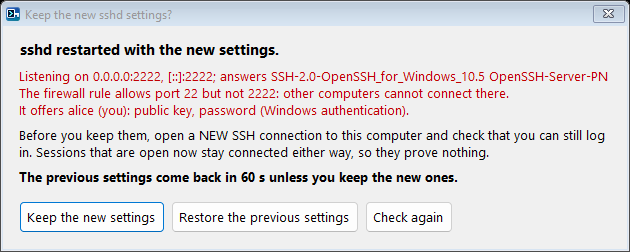

# OpenSSH Server Manager

_ prompt" width="96" align="right">

The management console of OpenSSH Server PN, in the spirit of the control panels
that commercial SSH servers ship. One executable, no installation, no runtime dependencies beyond
the .NET Framework 4.x that is part of Windows 8 and later (and available for Windows 7 SP1 /
Server 2008 R2). Works with the packages built by this repository and with the official Microsoft
packages (`%ProgramFiles%\OpenSSH`) as well as the inbox Windows feature
(`%SystemRoot%\System32\OpenSSH`); the install folder is read from the `sshd` service definition.


## What it does

| Tab | Functions |
|---|---|
| **Dashboard** | Live status of `sshd` and `ssh-agent` (state, PID, start mode), server version, listening endpoints, active session count and peers, firewall rule summary, host key fingerprints. One-click Start / Stop / Restart, *Test configuration* (`sshd -t`), *Add my public key*, *Generate missing host keys* (`ssh-keygen -A` with correct ACLs), *Connect* (opens `ssh localhost`), *Setup wizard*, Event Viewer and config folder shortcuts. Says when `sshd_config` was saved after `sshd` started, so a restart is needed. Refreshes every 5 seconds in the background, so the window stays responsive. Restart and Stop ask first and leave connected sessions connected: each runs in its own `sshd-session.exe` process. |
| **Setup wizard** | Offered once at the first start, and on the Dashboard: the port and the network profiles of the firewall rule, adding your public key, how accounts log in (keep them, administrators with a key only, or everyone with a key only; the key-only choices need a key authorized for you), the recommended settings, and who may log in (`AllowGroups`). Nothing is written until *Apply*, which goes through the usual preview, backup, restart and keep-or-restore question. |
| **Sessions** | Live view of every connection: `sshd-session.exe` PID, owning user, start time, duration and peer address, IPv4 and IPv6 (resolved through the TCP connection tables). Select one or several; *Disconnect selected* (or Delete) and *Disconnect all* end sessions immediately, with confirmation. Refreshes every 5 seconds. |
| **Settings** | Form-based editing of the directives that matter day to day: port and listen address, empty passwords, allow and deny lists for users and groups, authentication limits and timeouts, connection throttling (`MaxStartups`, `PerSourcePenalties`, exempt list), forwarding and TTY policy, banner, logging destination and level, algorithms, RSA minimum size, PowerShell remoting subsystem, and the default shell (registry). Each field shows the effective value reported by `sshd -T`. A save writes only the fields you changed. `Port` and `ListenAddress` edit the first line and keep the others. The Allow and Deny lists show every line of the file together, because `sshd` adds them up, and a save writes them as one line. A value that `sshd` does not use after the save (an `Include` or a `Match all` block sets it first) is reported, and a note says when the file includes other files. Numbers and name lists are checked as you type. *Backups* compares the backups kept at every save with the current file and restores one. |
| *All editing tabs* | Every save of `sshd_config` (Settings, Authentication, text tab, Hardening, key generator, wizard) shows the changes first, added and removed lines with their context, and can be cancelled. It warns when your own account would be refused afterwards (`DenyUsers`, `AllowUsers`, `DenyGroups`, `AllowGroups`, worked out the way `sshd` does it). It does not write over a file that another program changed after the window read it, unless you say so. After *Save and restart* the server is checked (listening, answering with an SSH banner, the firewall rule admits the port, your access) and you are asked to keep the new settings: without an answer within 60 seconds, or with *Restore*, the previous file comes back and `sshd` restarts with it. A tab with changes not saved shows `*` after its name; closing the window asks first. Long operations run in the background with a progress bar, so the window never shows "Not Responding". |
| **Authentication** | Chooses how accounts log in: **Windows authentication** (the Windows account name and password, checked by Windows), **public key**, and **Kerberos** single sign-on on domain members. With Windows authentication and public key both ticked, either one is enough, or both are required: the key first, then the password. **Rules for single users or groups** override this, in order: the first rule that matches an account applies. *Show its login methods* works out the methods of any account from the settings on the tab, before they are applied, the way `sshd` does; *Ask the running server* shows what the server offers an account. *Apply* warns before you would lock yourself out, then saves with the usual preview, check, backup and keep-or-restore question, and asks the running server which methods it now offers you. See [Login methods](#login-methods). |
| **sshd_config (text)** | Full-text editor for the configuration file with *Validate*, *Save*, *Save and restart*, *Find* (Ctrl+F; F3 and Shift+F3 for the next and previous match) and *Open in Notepad*. |
| **Keys** | `administrators_authorized_keys` and any user's `.ssh\authorized_keys`: list with key type, comment, SHA-256 fingerprint and options; add from file or paste; remove (also with Delete); *Fix permissions* applies the ACL that `sshd` requires (SYSTEM and Administrators, plus the owner for user files) using SIDs, so it works on any Windows language. Every write also makes sure the file's owner is one that `sshd` accepts (the account, SYSTEM or Administrators). Adding and removing keys keeps every other line, comments included. Fingerprints are worked out once per key. |
| **Key generator** | Creates a key pair: Ed25519 (recommended), ECDSA P-256/384/521, RSA 3072/4096, or the experimental post-quantum ML-DSA-44+Ed25519. Each key is verified before it is shown: the private key must reproduce the public key, an encrypted key must not open without its passphrase, and only you, SYSTEM and Administrators may read it, which is what ssh requires. The passphrase reaches `ssh-keygen` through `SSH_ASKPASS`, never on a command line, so process auditing cannot record it. An existing key is never overwritten; it is kept under a dated name. *Allow this key to log in* adds the public key to the file `sshd` reads for your account, asked from `sshd -T -C`. For ML-DSA it offers to enable the algorithm on this server. *Test login with this key* connects to this server with that key only: public key authentication only, host key pinned to this server's keys. |
| **Client** | The ssh client of your account, for connections from this computer. The entries of `known_hosts` with their fingerprints: remove them, or *Add a server's keys*, which reads them with `ssh-keyscan` and adds them only after you compared the fingerprints. The `Host` blocks of `%USERPROFILE%\.ssh\config`: add, edit, remove, connect (ssh starts without administrator rights, since your configuration can run commands); other lines of a block are kept, and the file stays readable by you only. The keys in `ssh-agent`: add a key (its passphrase goes through `SSH_ASKPASS`), remove one, start the agent. |
| **Firewall** | Shows the inbound rule for `sshd.exe`; enable or disable it, choose Domain / Private / Public profiles and the port; create the rule if it is missing; remove it. Asks first when the rule would be switched off or would no longer allow the port `sshd` listens on. A rule with several ports keeps its port list; you are asked before a port is added or the list is replaced. Uses the Windows Firewall COM API, not `netsh` text parsing. |
| **Logs** | Events of the *OpenSSH/Operational* event log for the last hour, 24 hours, 7 or 30 days, or all, with a text filter, shortcuts for failed and accepted logins, *Copy selected*, and *Export* to CSV, HTML or text. Reading can be cancelled. Enter or a double-click shows an event in full. *Failed logins by address* groups failed and abandoned logins by client address (count, first and last time, the account names tried) and keeps a firewall block list: *Block selected* adds addresses to one inbound block rule for `sshd`'s ports, *Unblock selected* removes them. This computer's own addresses are refused, and blocking an address that has an SSH connection open warns first. Also the tail of the file log when `SyslogFacility LOCAL0..7` is used. |
| **Hardening** | 27 checks with OK / WARN / INFO results. Service, firewall and host keys; the binaries both services run; a security audit (only administrators can change the program folder, `sshd_config`, the logs, the registry key behind `DefaultShell` and the two services, and nobody else can read the private host keys); whether SSH is reachable on a network that is currently public; whether a Windows password alone is enough although administrator keys exist; keyboard-interactive; `MaxAuthTries`, penalties, throttling, idle timeout, login grace time, minimum RSA size, log level, algorithms, login restriction, banner, forwarding. *Fix selected* (or Enter on a warning) fixes the selected warnings: settings in one save with the preview and one restart; the service, host keys, key file permissions and public-network exposure each after a question. Login methods and login restrictions open their tab instead of being changed. *Apply recommended settings* sets the idle timeout, `MaxAuthTries 4`, `LoginGraceTime 60`, `RequiredRSASize 2048`, `LogLevel VERBOSE` and `KbdInteractiveAuthentication no`. *Export report* writes the checks as CSV, HTML or text. |
| **About** | Paths, versions, the manager's own log file, documentation links, and the preferences of your account (`HKCU\Software\OpenSSH Server Manager`): appearance (like Windows, light or dark; high contrast always uses its own colours), the preview before a save, the keep-or-restore question after a restart, the icon in the notification area, minimizing to it, and when failed logins cause a notification. |

Keyboard: Ctrl+S saves the tab shown, F5 refreshes it, Ctrl+1 to Ctrl+9 open the tabs, Ctrl+F
finds in the `sshd_config` text, Enter opens the selected item of a list and Delete removes it.
Lists sort by a click on a column header, except the rules of the Authentication tab and the
hosts of the client configuration, whose order decides which one applies.

The icon in the notification area shows whether `sshd` runs and how many connections it has, and
has a menu to open the window, start, stop or restart `sshd`. It notifies when `sshd` stops
without the manager stopping it, and when failed logins cross a threshold (10 within 5 minutes by
default; the manager must be running for that).



## Login methods


| On the Authentication tab | Written to `sshd_config` |
|---|---|
| Windows authentication | `PasswordAuthentication yes` or `no`. Windows checks the password (`LogonUser`), so the account's password, lockout and expiry policies apply |
| Public key | `PubkeyAuthentication yes` or `no` |
| Kerberos single sign-on | `GSSAPIAuthentication yes` or `no`. It needs an Active Directory domain, so the box is greyed out on a workgroup computer |
| Either one is enough | `AuthenticationMethods` left at its default, `any` |
| Both are required | `AuthenticationMethods publickey,password`. With Kerberos also ticked, `publickey,password gssapi-with-mic`: Kerberos stays a method on its own |
| Always, when you apply | `KbdInteractiveAuthentication no`. OpenSSH for Windows has no keyboard-interactive back end: a server that offers the method refuses it at once, and each attempt counts against `MaxAuthTries`, so a client with several keys can be cut off before its password prompt |

Rules are `Match User` and `Match Group` blocks in one marked section. The section goes before
any other `Match` block, so the rules take precedence, and ends with `Match all`:

```
# Login methods by user and group, managed on the Authentication tab of OpenSSH Server Manager.
# The first rule that matches an account applies; all other accounts use the methods set above.
Match Group administrators
	PasswordAuthentication no
	PubkeyAuthentication yes
	GSSAPIAuthentication no
	AuthenticationMethods any
Match User backup
	PasswordAuthentication yes
	PubkeyAuthentication yes
	GSSAPIAuthentication no
	AuthenticationMethods publickey,password
Match all
# End of login methods by user and group.
```

- Every rule sets all four keywords, so the first rule that matches an account decides for it.
- The rule dialog suggests local accounts and groups and checks that the name exists. It stores
  the name the way `sshd` compares it: lower case, `name` for local accounts and built-in groups,
  `DOMAIN\name` for domain accounts. Well-known groups such as *Everyone* are refused, because
  `sshd` matches only local, built-in and domain groups.
- A section edited by hand in a way the tab does not write is left alone, and the tab says why.
  `Match` blocks elsewhere in the file that set login methods are listed as a warning.
- *Show its login methods* runs `sshd -T` for the account against the settings on the tab. For
  another account, when the configuration has a `Match Group` block (the default one has), it runs
  `sshd` as SYSTEM through a one-off scheduled task. Run by an administrator, `sshd` cannot see
  another account's groups and would skip every group rule.
- *Apply* asks first. The question includes a warning, with *No* as the default, when your own
  account would be left without a method that works, for example public key only while no key is
  authorized for you.


## Safety design

- Runs elevated (the manifest requests administrator rights; a non-elevated start re-launches
  itself with a UAC prompt).
- Every configuration save is written to a temporary candidate first and validated with
  `sshd -t -f`. Only a configuration that `sshd` accepts replaces the live file. The new file is
  written next to `sshd_config` and swapped in with `ReplaceFile`, which keeps the file's
  permissions, so a crash or a full disk never leaves half a file. The previous file is kept as
  `sshd_config.bak.<date>-<time>` (a second save within the same second gets `-2`); the newest 50
  backups are kept.
- A save is refused, with a question, when `sshd_config` changed on disk after the window read it
  (SHA-256 of the file as read), so an edit made meanwhile in Notepad is not silently undone.
- Before a save, the changes are shown, and a warning comes when the account running the manager
  would be refused by `AllowUsers`, `DenyUsers`, `AllowGroups` or `DenyGroups`.
- *Save and restart*: if `sshd` does not start, the previous file is put back and `sshd` started
  again, without a question; the file that failed is kept as a backup. If it starts, the server is
  checked and you are asked to keep the new settings. Without an answer within 60 seconds (the
  time can be changed, and the question switched off, under About), the previous file comes back,
  like the display settings of Windows: a setting that locks you out also keeps you from answering
  remotely.
- Destructive actions (stop, restart, remove key, remove or switch off the firewall rule, reset to
  defaults, block an address) ask for confirmation. Nothing runs without a visible result in the
  status bar.
- All exceptions are caught, shown in a dialog and written to
  `%LocalAppData%\OpenSSH Server Manager\manager.log`; the process never terminates on an error.
- Firewall, ACL and service operations use Windows APIs (COM, `System.Security.AccessControl`,
  `ServiceController`) rather than parsing localized command output.
- Port changes offer to add the new port to the firewall rule; the old port is closed only when the new settings are kept, and a rolled-back restart also puts the rule back.

## Command line

| Command | Purpose |
|---|---|
| `OpenSSHServerManager.exe` | Start the console |
| `OpenSSHServerManager.exe --check [report.txt]` | Print a status report (services, listeners, config test, firewall, host keys, hardening checks); exit code 0 when healthy. A service that runs the in-box binary instead of the installed package counts as a problem |
| `OpenSSHServerManager.exe --unittest [report.txt]` | Run the 44 unit tests: the program logic alone (config editing, comments after values, repeated and cumulative keywords, `ListenAddress` ports, `Include`, backups and `ReplaceFile`, changes on disk, differences between texts, the access check as `sshd` decides it, failed-login messages, the firewall block list, login-method rules, quoting of names as `sshd` reads them, including 5,000 random names, key parsing, the ssh client files, exports, hardening fixes, themes), with no `sshd`, no service and no changes. Needs no administrator rights: run it with `$env:__COMPAT_LAYER = 'RunAsInvoker'` to skip the elevation prompt. CI runs these on every push that changes the manager or its workflow |
| `OpenSSHServerManager.exe --selftest [report.txt]` | Run the unit tests plus 42 tests against the installed server, 86 in all. Window tests open the main window off-screen on a scratch `sshd_config` (unsaved changes, refused saves, a save that keeps other `Port` lines and joins the `AllowUsers` lines, a save refused because the file changed meanwhile, reloads, fields checked as you type, the changes shown before a save, the dark and light palettes, text that does not fit at 100% and 150%, names for screen readers, the background refresh); a firewall test adds a disabled rule of its own and removes it. Also: config validation, login-method rules and their effect as `sshd -T` reports it, rule names with `'` and `\` against `sshd -T` (a configuration and host key of its own), account names, `sshd -T` as SYSTEM, the lock-out warning, key ACLs, key generation of every type through `SSH_ASKPASS`, security audit probes, APIs. The live configuration, keys and service are not modified. Without administrator rights, the tests that read the live host keys or the security of the service fail and the ones that need them are skipped |
| `OpenSSHServerManager.exe --keytest [report.txt]` | End-to-end key test against this server: for every key type, with and without a passphrase, generate a key, authorize it for the current account, log in with it and remove it; then check that a wrong passphrase and an unauthorized key are refused. Experimental types the server does not accept are reported as skipped. The `authorized_keys` file is restored byte for byte afterwards |
| `OpenSSHServerManager.exe --authtest [report.txt]` | End-to-end test of the Authentication tab with real logins. Nine settings: Windows authentication only, public key only, either one, both required, a group rule, a user rule, rule order, a rule for another group, Kerberos offered. Each is written the way the tab writes it into a copy of `sshd_config` and served by a temporary `sshd` service on 127.0.0.1, on a free port. A temporary local account (random name and password, member of Users) logs in with its password, its key and both; wrong passwords must be refused. The live `sshd`, its configuration and its keys are not touched. The service, the account and the test folder are removed at the end. The account's profile stays loaded, because `sshd` does not unload profiles, so a one-time startup task deletes it two minutes after the next restart, and at every restart until it is gone |
| `OpenSSHServerManager.exe [--ui-scale 1.5] [--theme dark] --screenshot <folder>` | Render every tab off-screen to PNG files (`--ui-scale` lays the window out as on a 150% display, `--theme` chooses the light or dark colours), plus the Authentication tab with example rules, the rule dialog, the dialogs around saving, the failed-login list and the pages of the setup wizard, with example content (UI regression test, does not touch the desktop; `DrawToBitmap` leaves the comparison boxes empty, which the window tests check instead) |

The `--check`, `--selftest`, `--keytest` and `--authtest` reports are used for the verification
recorded in `docs/CHANGELOG.md`.

## Building

```powershell
.\build.ps1                       # produces .\bin\OpenSSHServerManager.exe
.\build.ps1 -Csc <path>\csc.exe   # with another Roslyn compiler, e.g. a pinned Microsoft.Net.Compilers.Toolset
```

Requirements: Windows with .NET Framework 4.x and the Roslyn C# compiler from Visual Studio 2022
Build Tools (the inbox C# 5 compiler of the .NET Framework cannot build this source). The build is
a single `csc` call over every `.cs` file in this folder, no project system needed; warnings stop
it. The build is deterministic: the same source and compiler give the same SHA-256.

| File | Contents |
|---|---|
| `Program.cs` | Entry point, command line, `--check`, `--screenshot` |
| `SelfTest.cs` | `--unittest` and `--selftest` |
| `Platform.cs` | Elevation, log, process runner, ACLs and file owners |
| `Ssh.cs` | Paths and versions, the services, listeners, banners and sessions |
| `SshdConfig.cs` | The `sshd_config` model (comments, repeated and cumulative keywords, backups, safe writing) and `SshdArgs`, which quotes arguments the way `sshd` reads them |
| `Keys.cs`, `KeyGen.cs` | Authorized keys, host keys, the key generator and `--keytest` |
| `Auth.cs`, `AuthTest.cs` | Login methods, account names, the access check, `sshd -T` as SYSTEM, and `--authtest` |
| `WindowsSettings.cs` | Default shell, firewall rule and block list, event log and failed logins |
| `Hardening.cs` | Hardening checks and the security audit |
| `Sessions.cs` | Live sessions |
| `Client.cs` | The ssh client of the account: `known_hosts`, `.ssh\config`, `ssh-agent` |
| `MainForm.cs`, `Dialogs.cs`, `Wizard.cs` | The window, its dialogs and the setup wizard |
| `Theme.cs`, `Widgets.cs`, `Prefs.cs` | Colours (light, dark, high contrast), list sorting and export, preferences and text comparison |
| `icon\render.py` | The program icon: draws every size (16 to 256 px, small sizes by hand, pixel by pixel) and writes `icon\app.ico`, which `build.ps1` builds into the executable. Needs Python 3 with Pillow; running it again gives the same file |

Download: the executable and its `.exe.config` (keep both in one folder) are attached to the
product releases, such as [v10.5.1.0](https://github.com/patnawa/openssh_server_pn/releases/tag/v10.5.1.0), and to releases of their
own, such as [manager-v1.5.0](https://github.com/patnawa/openssh_server_pn/releases/tag/manager-v1.5.0), each with `SHA256SUMS.txt`.

The built `bin\OpenSSHServerManager.exe` and its `.exe.config` are committed. After a change,
rebuild them with `build.ps1` and commit them with the source. The GitHub workflow
`.github/workflows/manager.yml` builds the source and runs `--unittest` on the new build and on
the committed executable, and fails when the committed executable's version differs from the
source. A tag `manager-vX.Y.Z` publishes the committed executable, its `.exe.config` and
`SHA256SUMS.txt` as a release, which is not marked as the latest one: the product release keeps that.

## Limitations

- Manages one server instance (the `sshd` service) on the local machine. For remote servers,
  run it over RDP or PowerShell remoting, or copy `sshd_config` with your configuration tool.
- Edits top-level directives and the login-method rules of the Authentication tab; other `Match`
  blocks are preserved and edited on the text tab. Files named by `Include` are not edited; the
  Settings tab says when there are some and reports a value they override.
- The window is DPI-aware for the display it starts on (system DPI). Moved to a monitor with
  another scale, Windows stretches it, so it looks blurry there. Per-monitor scaling would need
  every size to follow the monitor, and it was not done because it could not be tested here on
  monitors with different scales.
- The texts are in English and written in the code; there are no resource files for translations
  yet. Tabs are identified by their page, not their caption, so translated captions would work.
- The block list of the Logs tab is kept by hand: the manager does not block addresses by
  itself, and its failed-login notification works only while it runs. `sshd`'s own
  `PerSourcePenalties` slow repeat offenders down meanwhile.
- `sshd` for Windows loads an account's profile at login and never unloads it, and Windows
  keeps it loaded (it could not be unloaded here), so the profile of an account that has logged
  in over SSH can be deleted only after a restart.
- A Kerberos login was not tested (no Active Directory domain was available); the tests show only
  that the server offers Kerberos when the box is ticked.
- Windows Server Core has no desktop, so use `--check` there and edit `sshd_config` directly.
