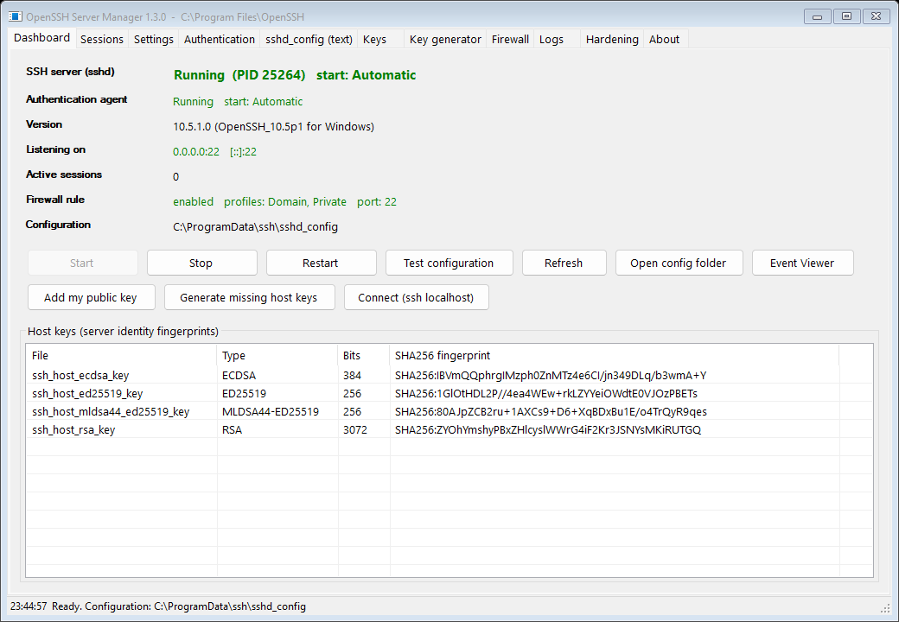
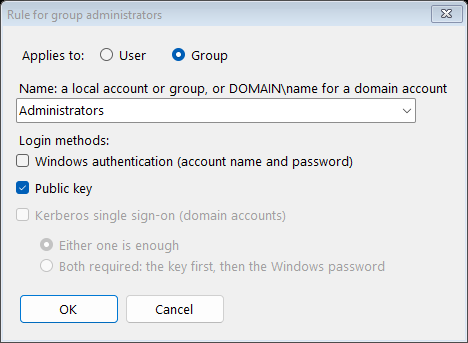

# OpenSSH Server Manager

_ prompt" width="96" align="right">

The management console of OpenSSH Server PN, in the spirit of the control panels
that commercial SSH servers ship. One executable, no installation, no runtime dependencies beyond
the .NET Framework 4.x that is part of Windows 8 and later (and available for Windows 7 SP1 /
Server 2008 R2). Works with the packages built by this repository and with the official Microsoft
packages (`%ProgramFiles%\OpenSSH`) as well as the inbox Windows feature
(`%SystemRoot%\System32\OpenSSH`); the install folder is read from the `sshd` service definition.



## What it does

| Tab | Functions |
|---|---|
| **Dashboard** | Live status of `sshd` and `ssh-agent` (state, PID, start mode), server version, listening endpoints, active session count and peers, firewall rule summary, host key fingerprints. One-click Start / Stop / Restart, *Test configuration* (`sshd -t`), *Add my public key*, *Generate missing host keys* (`ssh-keygen -A` with correct ACLs), *Connect* (opens `ssh localhost`), Event Viewer and config folder shortcuts. Says when `sshd_config` was saved after `sshd` started, so a restart is needed. Refreshes every 5 seconds in the background, so the window stays responsive. Restart and Stop leave connected sessions connected: each runs in its own `sshd-session.exe` process. |
| **Sessions** | Live view of every connection: `sshd-session.exe` PID, owning user, start time, duration and peer address, IPv4 and IPv6 (resolved through the TCP connection tables). *Disconnect selected* or *Disconnect all* end sessions immediately, with confirmation. Refreshes every 5 seconds. |
| **Settings** | Form-based editing of the directives that matter day to day: port and listen address, empty passwords, allow and deny lists for users and groups, authentication limits and timeouts, connection throttling (`MaxStartups`, `PerSourcePenalties`, exempt list), forwarding and TTY policy, banner, logging destination and level, algorithms, RSA minimum size, PowerShell remoting subsystem, and the default shell (registry). Each field shows the effective value reported by `sshd -T`, and notes when a directive appears more than once in the file. A save writes only the fields you changed, so repeated directives such as several `ListenAddress` lines are kept. Numbers and name lists are checked as you type. A save that is refused changes nothing, also for the other tabs. |
| *All editing tabs* | A tab with changes not saved shows `*` after its name. When another tab saves `sshd_config`, your unsaved changes stay, and the text tab says the file changed. Closing the window asks first. |
| **Authentication** | Chooses how accounts log in: **Windows authentication** (the Windows account name and password, checked by Windows), **public key**, and **Kerberos** single sign-on on domain members. With Windows authentication and public key both ticked, either one is enough, or both are required: the key first, then the password. **Rules for single users or groups** override this, in order: the first rule that matches an account applies. *Show its login methods* works out the methods of any account from the settings on the tab, before they are applied, the way `sshd` does; *Ask the running server* shows what the server offers an account. *Apply* warns before you would lock yourself out, then saves with the usual check, backup and rollback, and asks the running server which methods it now offers you. See [Login methods](#login-methods). |
| **sshd_config (text)** | Full-text editor for the configuration file with *Validate*, *Save*, *Save and restart* and *Open in Notepad*. |
| **Keys** | `administrators_authorized_keys` and any user's `.ssh\authorized_keys`: list with key type, comment, SHA-256 fingerprint and options; add from file or paste; remove; *Fix permissions* applies the ACL that `sshd` requires (SYSTEM and Administrators, plus the owner for user files) using SIDs, so it works on any Windows language. Adding and removing keys keeps every other line, comments included. |
| **Key generator** | Creates a key pair: Ed25519 (recommended), ECDSA P-256/384/521, RSA 3072/4096, or the experimental post-quantum ML-DSA-44+Ed25519. Each key is verified before it is shown: the private key must reproduce the public key, an encrypted key must not open without its passphrase, and only you, SYSTEM and Administrators may read it, which is what ssh requires. The passphrase reaches `ssh-keygen` through `SSH_ASKPASS`, never on a command line, so process auditing cannot record it. An existing key is never overwritten; it is kept under a dated name. *Allow this key to log in* adds the public key to the file `sshd` reads for your account, asked from `sshd -T -C`. For ML-DSA it offers to enable the algorithm on this server. *Test login with this key* connects to this server with that key only: public key authentication only, host key pinned to this server's keys. |
| **Firewall** | Shows the inbound rule for `sshd.exe`; enable or disable it, choose Domain / Private / Public profiles and the port; create the rule if it is missing; remove it. A rule with several ports keeps its port list; you are asked before a port is added or the list is replaced. Uses the Windows Firewall COM API, not `netsh` text parsing. |
| **Logs** | Last N events from the *OpenSSH/Operational* event log with a text filter and shortcuts for failed and accepted logins; tail of the file log when `SyslogFacility LOCAL0..7` is used. |
| **Hardening** | 27 checks with OK / WARN / INFO results. Service, firewall and host keys; the binaries both services run; a security audit (only administrators can change the program folder, `sshd_config`, the logs, the registry key behind `DefaultShell` and the two services, and nobody else can read the private host keys); whether SSH is reachable on a network that is currently public; whether a Windows password alone is enough although administrator keys exist; keyboard-interactive; `MaxAuthTries`, penalties, throttling, idle timeout, login grace time, minimum RSA size, log level, algorithms, login restriction, banner, forwarding. *Apply recommended settings* sets the idle timeout, `MaxAuthTries 4`, `LoginGraceTime 60`, `RequiredRSASize 2048`, `LogLevel VERBOSE` and `KbdInteractiveAuthentication no`. Windows authentication and login restrictions are never changed automatically. |
| **About** | Paths, versions, the manager's own log file and documentation links. |

## Login methods


| On the Authentication tab | Written to `sshd_config` |
|---|---|
| Windows authentication | `PasswordAuthentication yes` or `no`. Windows checks the password (`LogonUser`), so the account's password, lockout and expiry policies apply |
| Public key | `PubkeyAuthentication yes` or `no` |
| Kerberos single sign-on | `GSSAPIAuthentication yes` or `no`. It needs an Active Directory domain, so the box is greyed out on a workgroup computer |
| Either one is enough | `AuthenticationMethods` left at its default, `any` |
| Both are required | `AuthenticationMethods publickey,password`. With Kerberos also ticked, `publickey,password gssapi-with-mic`: Kerberos stays a method on its own |
| Always, when you apply | `KbdInteractiveAuthentication no`. OpenSSH for Windows has no keyboard-interactive back end: a server that offers the method refuses it at once, and each attempt counts against `MaxAuthTries`, so a client with several keys can be cut off before its password prompt |

Rules are `Match User` and `Match Group` blocks in one marked section. The section goes before
any other `Match` block, so the rules take precedence, and ends with `Match all`:

```
# Login methods by user and group, managed on the Authentication tab of OpenSSH Server Manager.
# The first rule that matches an account applies; all other accounts use the methods set above.
Match Group administrators
	PasswordAuthentication no
	PubkeyAuthentication yes
	GSSAPIAuthentication no
	AuthenticationMethods any
Match User backup
	PasswordAuthentication yes
	PubkeyAuthentication yes
	GSSAPIAuthentication no
	AuthenticationMethods publickey,password
Match all
# End of login methods by user and group.
```

- Every rule sets all four keywords, so the first rule that matches an account decides for it.
- The rule dialog suggests local accounts and groups and checks that the name exists. It stores
  the name the way `sshd` compares it: lower case, `name` for local accounts and built-in groups,
  `DOMAIN\name` for domain accounts. Well-known groups such as *Everyone* are refused, because
  `sshd` matches only local, built-in and domain groups.
- A section edited by hand in a way the tab does not write is left alone, and the tab says why.
  `Match` blocks elsewhere in the file that set login methods are listed as a warning.
- *Show its login methods* runs `sshd -T` for the account against the settings on the tab. For
  another account, when the configuration has a `Match Group` block (the default one has), it runs
  `sshd` as SYSTEM through a one-off scheduled task. Run by an administrator, `sshd` cannot see
  another account's groups and would skip every group rule.
- *Apply* asks first. The question includes a warning, with *No* as the default, when your own
  account would be left without a method that works, for example public key only while no key is
  authorized for you.



## Safety design

- Runs elevated (the manifest requests administrator rights; a non-elevated start re-launches
  itself with a UAC prompt).
- Every configuration save is written to a temporary candidate first and validated with
  `sshd -t -f`. Only a configuration that `sshd` accepts replaces the live file, and the previous
  file is kept as `sshd_config.bak.<timestamp>` next to it.
- *Save and restart* verifies that the service comes back; if it does not, the manager offers to
  restore the backup and start `sshd` again (automatic rollback).
- Destructive actions (stop, remove key, remove firewall rule, reset to defaults) ask for
  confirmation. Nothing runs without a visible result in the status bar.
- All exceptions are caught, shown in a dialog and written to
  `%LocalAppData%\OpenSSH Server Manager\manager.log`; the process never terminates on an error.
- Firewall, ACL and service operations use Windows APIs (COM, `System.Security.AccessControl`,
  `ServiceController`) rather than parsing localized command output.
- Port changes prompt to update the firewall rule so the server does not become unreachable.

## Command line

| Command | Purpose |
|---|---|
| `OpenSSHServerManager.exe` | Start the console |
| `OpenSSHServerManager.exe --check [report.txt]` | Print a status report (services, listeners, config test, firewall, host keys, hardening checks); exit code 0 when healthy. A service that runs the in-box binary instead of the installed package counts as a problem |
| `OpenSSHServerManager.exe --unittest [report.txt]` | Run the 20 unit tests: the program logic alone (config editing, login-method rules, quoting of names as `sshd` reads them, including 5,000 random names, key parsing), with no `sshd`, no service and no changes. Needs no administrator rights: run it with `$env:__COMPAT_LAYER = 'RunAsInvoker'` to skip the elevation prompt. CI runs these on every push |
| `OpenSSHServerManager.exe --selftest [report.txt]` | Run the unit tests plus 39 tests against the installed server, 59 in all. Window tests open the main window off-screen on a scratch `sshd_config` (unsaved changes, refused saves, reloads, fields checked as you type, text that does not fit at 100% and 150%, names for screen readers, the background refresh); a firewall test adds a disabled rule of its own and removes it. Also: config validation, login-method rules and their effect as `sshd -T` reports it, rule names with `'` and `\` against `sshd -T` (a configuration and host key of its own), account names, `sshd -T` as SYSTEM, the lock-out warning, key ACLs, key generation of every type through `SSH_ASKPASS`, security audit probes, APIs. The live configuration, keys and service are not modified |
| `OpenSSHServerManager.exe --keytest [report.txt]` | End-to-end key test against this server: for every key type, with and without a passphrase, generate a key, authorize it for the current account, log in with it and remove it; then check that a wrong passphrase and an unauthorized key are refused. Experimental types the server does not accept are reported as skipped. The `authorized_keys` file is restored byte for byte afterwards |
| `OpenSSHServerManager.exe --authtest [report.txt]` | End-to-end test of the Authentication tab with real logins. Nine settings: Windows authentication only, public key only, either one, both required, a group rule, a user rule, rule order, a rule for another group, Kerberos offered. Each is written the way the tab writes it into a copy of `sshd_config` and served by a temporary `sshd` service on 127.0.0.1, on a free port. A temporary local account (random name and password, member of Users) logs in with its password, its key and both; wrong passwords must be refused. The live `sshd`, its configuration and its keys are not touched. The service, the account and the test folder are removed at the end. The account's profile stays loaded, because `sshd` does not unload profiles, so a one-time startup task deletes it two minutes after the next restart, and at every restart until it is gone |
| `OpenSSHServerManager.exe [--ui-scale 1.5] --screenshot <folder>` | Render every tab off-screen to PNG files (`--ui-scale` lays the window out as on a 150% display), plus the Authentication tab with example rules and the rule dialog (UI regression test, does not touch the desktop) |

The `--check`, `--selftest`, `--keytest` and `--authtest` reports are used for the verification
recorded in `docs/CHANGELOG.md`.

## Building

```powershell
.\build.ps1            # produces .\bin\OpenSSHServerManager.exe
```

Requirements: Windows with .NET Framework 4.x; the Roslyn compiler from Visual Studio 2022 Build
Tools is used when present, otherwise the inbox C# compiler. The build is a single `csc` call over
every `.cs` file in this folder, no project system needed. With Roslyn the build is deterministic:
the same source and compiler give the same SHA-256.

| File | Contents |
|---|---|
| `Program.cs` | Entry point, command line, `--check`, `--screenshot` |
| `SelfTest.cs` | `--unittest` and `--selftest` |
| `Platform.cs` | Elevation, log, process runner, ACLs |
| `Ssh.cs` | Paths and versions, the services, listeners and sessions |
| `SshdConfig.cs` | The `sshd_config` model and `SshdArgs`, which quotes arguments the way `sshd` reads them |
| `Keys.cs`, `KeyGen.cs` | Authorized keys, host keys, the key generator and `--keytest` |
| `Auth.cs`, `AuthTest.cs` | Login methods, account names, `sshd -T` as SYSTEM, and `--authtest` |
| `WindowsSettings.cs` | Default shell, firewall rule, event log |
| `Hardening.cs` | Hardening checks and the security audit |
| `Sessions.cs` | Live sessions |
| `MainForm.cs`, `Dialogs.cs` | The window and its dialogs |
| `icon
ender.py` | The program icon: draws every size (16 to 256 px, small sizes by hand, pixel by pixel) and writes `iconpp.ico`, which `build.ps1` builds into the executable. Needs Python 3 with Pillow; running it again gives the same file |

The built `bin\OpenSSHServerManager.exe` and its `.exe.config` are committed. After a change,
rebuild them with `build.ps1` and commit them with the source. The GitHub workflow
`.github/workflows/manager.yml` builds the source and runs `--unittest` on the new build and on
the committed executable, and fails when the committed executable's version differs from the
source. A tag `manager-vX.Y.Z` publishes the committed executable and `SHA256SUMS.txt` as a release.

## Limitations

- Manages one server instance (the `sshd` service) on the local machine. For remote servers,
  run it over RDP or PowerShell remoting, or copy `sshd_config` with your configuration tool.
- Edits top-level directives and the login-method rules of the Authentication tab; other `Match`
  blocks are preserved and edited on the text tab.
- `sshd` for Windows loads an account's profile at login and never unloads it, and Windows
  keeps it loaded (it could not be unloaded here), so the profile of an account that has logged
  in over SSH can be deleted only after a restart.
- A Kerberos login was not tested (no Active Directory domain was available); the tests show only
  that the server offers Kerberos when the box is ticked.
- Windows Server Core has no desktop, so use `--check` there and edit `sshd_config` directly.
