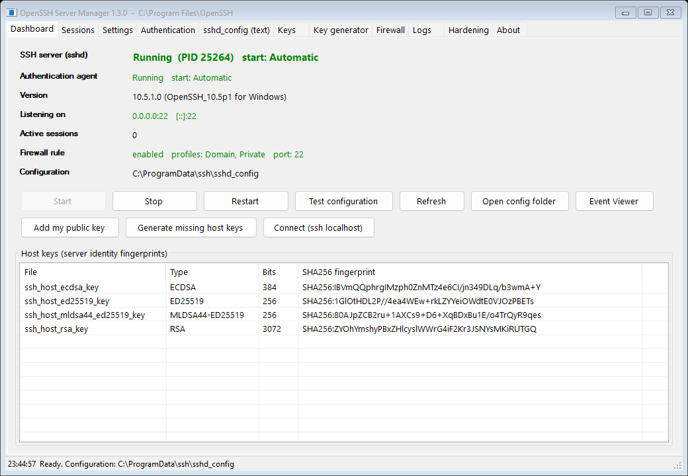
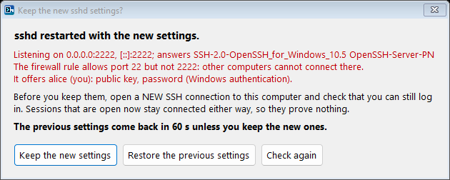
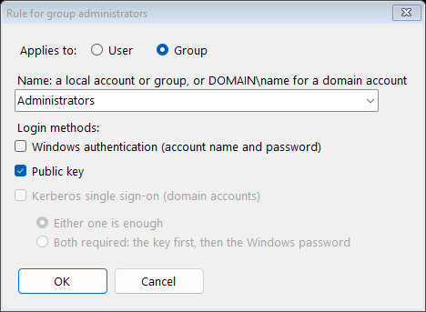
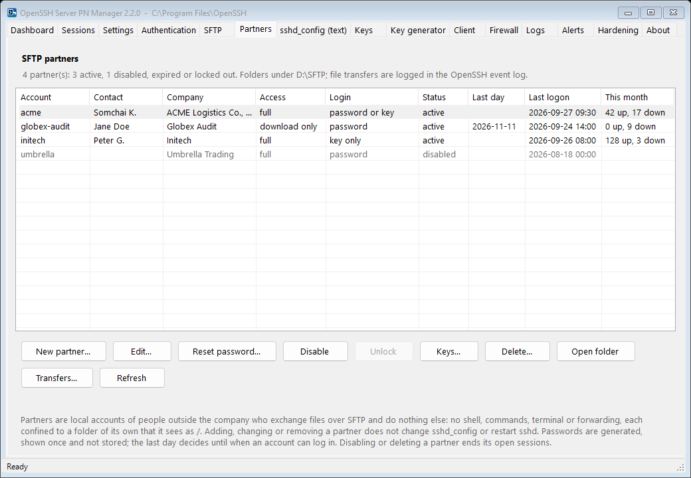
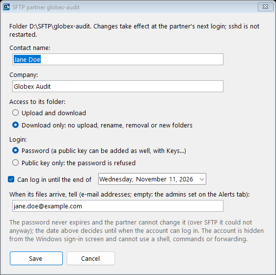
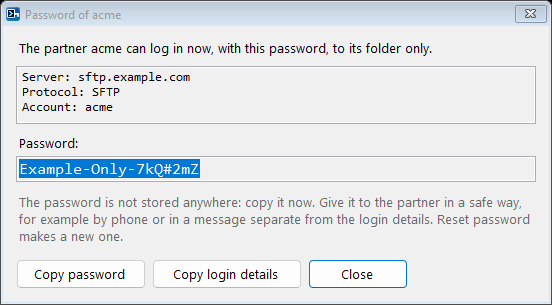
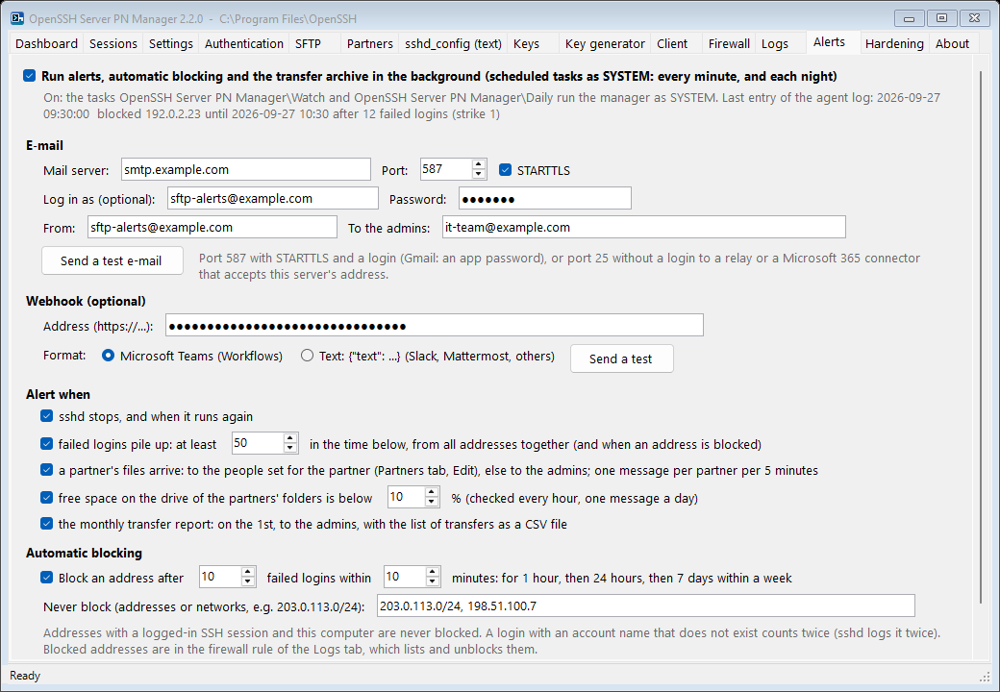
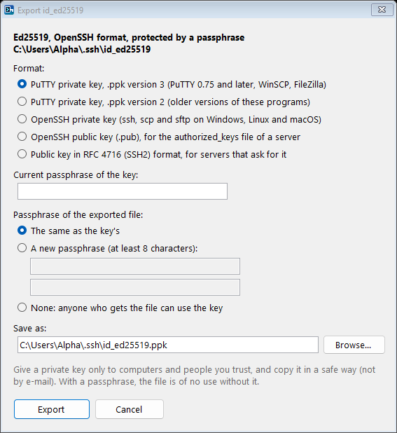
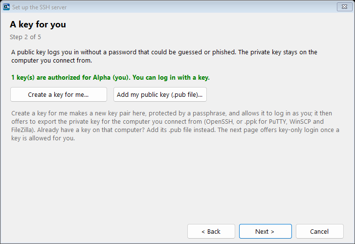

# OpenSSH Server PN Manager

_ prompt" width="96" align="right">

The management console of OpenSSH Server PN, in the spirit of the control panels
that commercial SSH servers ship. One executable, no runtime dependencies beyond the .NET
Framework 4.5 or later that is part of Windows 8 and later (and available for Windows 7 SP1 /
Server 2008 R2). The server packages after 10.5.3.0 install it next to `sshd.exe`, with
Start-menu shortcuts; it also runs on its own, from any folder. Works with the packages built by
this repository and with the official Microsoft packages (`%ProgramFiles%\OpenSSH`) as well as the
inbox Windows feature (`%SystemRoot%\System32\OpenSSH`); the install folder is read from the `sshd`
service definition.
Up to version 1.6.0 it was called OpenSSH Server Manager (`OpenSSHServerManager.exe`); version 2.0.0
takes over its preferences, the rules section of the Authentication tab and the firewall block list.



## What it does

| Tab | Functions |
|---|---|
| **Dashboard** | Live status of `sshd` and `ssh-agent` (state, PID, start mode), server version, listening endpoints, active session count and peers, SFTP (on or off, transfers logged, SFTP-only accounts, SFTP sessions open), firewall rule summary, host key fingerprints. One-click Start / Stop / Restart, *Test configuration* (`sshd -t`), *Add my public key*, *Generate missing host keys* (`ssh-keygen -A` with correct ACLs), *Connect* (opens `ssh localhost`), *Setup wizard*, Event Viewer and config folder shortcuts. Says when `sshd_config` was saved after `sshd` started, so a restart is needed. Refreshes every 5 seconds in the background, so the window stays responsive. Restart and Stop ask first and leave connected sessions connected: each runs in its own `sshd-session.exe` process. |
| **Setup wizard** | Offered once at the first start, and opened by the package after a first installation with a window (packages after 10.5.3.0); also on the Dashboard, on the Key generator tab, in the menu of the notification area icon, in the Start menu (*OpenSSH Server PN setup wizard*) and with `--wizard`: the port and the network profiles of the firewall rule, a key for you (*Create a key for me* makes one protected by a passphrase, allows it to log in and offers to export it for the computer you connect from; or add the `.pub` file of a key you have), how accounts log in (keep them, administrators with a key only, or everyone with a key only; the key-only choices need a key authorized for you), the recommended settings, and who may log in (`AllowGroups`). Nothing is written until *Apply*, which goes through the usual preview, backup, restart and keep-or-restore question. |
| **Sessions** | Live view of every connection: `sshd-session.exe` PID, owning user, start time, duration, what it does (SFTP, scp, or the shell or command it runs, from the programs the session started) and peer address, IPv4 and IPv6 (resolved through the TCP connection tables). Select one or several; *Disconnect selected* (or Delete) and *Disconnect all* end sessions immediately, with confirmation. Refreshes every 5 seconds. |
| **Settings** | Form-based editing of the directives that matter day to day: port and listen address, empty passwords, allow and deny lists for users and groups, authentication limits and timeouts, connection throttling (`MaxStartups`, `PerSourcePenalties`, exempt list), forwarding and TTY policy, banner, logging destination and level, algorithms, RSA minimum size, PowerShell remoting subsystem, and the default shell (registry). Each field shows the effective value reported by `sshd -T`. A save writes only the fields you changed. `Port` and `ListenAddress` edit the first line and keep the others. The Allow and Deny lists show every line of the file together, because `sshd` adds them up, and a save writes them as one line. A value that `sshd` does not use after the save (an `Include` or a `Match all` block sets it first) is reported, and a note says when the file includes other files. Numbers and name lists are checked as you type. *Backups* compares the backups kept at every save with the current file and restores one. |
| *All editing tabs* | Every save of `sshd_config` (Settings, Authentication, text tab, Hardening, key generator, wizard) shows the changes first, added and removed lines with their context, and can be cancelled. It warns when your own account would be refused afterwards (`DenyUsers`, `AllowUsers`, `DenyGroups`, `AllowGroups`, worked out the way `sshd` does it). It does not write over a file that another program changed after the window read it, unless you say so. After *Save and restart* the server is checked (listening, answering with an SSH banner, the firewall rule admits the port, your access) and you are asked to keep the new settings: without an answer within 60 seconds, or with *Restore*, the previous file comes back and `sshd` restarts with it. A tab with changes not saved shows `*` after its name; closing the window asks first. Long operations run in the background with a progress bar, so the window never shows "Not Responding". |
| **Authentication** | Chooses how accounts log in: **Windows authentication** (the Windows account name and password, checked by Windows), **public key**, and **Kerberos** single sign-on on domain members. With Windows authentication and public key both ticked, either one is enough, or both are required: the key first, then the password. **Rules for single users or groups** override this, in order: the first rule that matches an account applies. *Show its login methods* works out the methods of any account from the settings on the tab, before they are applied, the way `sshd` does; *Ask the running server* shows what the server offers an account. *Apply* warns before you would lock yourself out, then saves with the usual preview, check, backup and keep-or-restore question, and asks the running server which methods it now offers you. See [Login methods](#login-methods). |
| **SFTP** | SFTP on or off (`Subsystem sftp`), transfer logging in the event log, and **SFTP-only accounts and groups**: they transfer files and do nothing else, optionally confined to a folder they see as `/` (`%u` for one folder per account), optionally download only. The first rule that matches an account applies. *Show its SFTP access* works out what the settings mean for any account. *Apply* creates the folders and gives the accounts access, then saves with the usual preview, check, backup and keep-or-restore question. See [SFTP](#sftp). |
| **Partners** | SFTP accounts for people outside the company: each one exchanges files in a folder of its own and does nothing else. *Set up partner accounts* (once) creates three local groups and writes their rules into `sshd_config`; after that, adding, changing or removing a partner never touches `sshd_config` or restarts `sshd`. *New partner* creates the local account with a generated password that is shown once and not stored, its folder, and optionally a last day, download-only access or key-only login. *Edit*, *Reset password*, *Disable* / *Enable* (ends its open sessions), *Unlock*, *Keys* (the partner's public keys), *Delete* (its folder stays unless you tick it), *Open folder*. The list shows contact, company, access, login method, status, last day, last logon and this month's uploads and downloads; *Transfers* opens the transfer history. See [SFTP partners](#sftp-partners). |
| **sshd_config (text)** | Full-text editor for the configuration file with *Validate*, *Save*, *Save and restart*, *Find* (Ctrl+F; F3 and Shift+F3 for the next and previous match) and *Open in Notepad*. |
| **Keys** | `administrators_authorized_keys` and any user's `.ssh\authorized_keys`: list with key type, comment, SHA-256 fingerprint and options; add from file or paste; remove (also with Delete); *Fix permissions* applies the ACL that `sshd` requires (SYSTEM and Administrators, plus the owner for user files) using SIDs, so it works on any Windows language. Every write also makes sure the file's owner is one that `sshd` accepts (the account, SYSTEM or Administrators). Adding and removing keys keeps every other line, comments included. Fingerprints are worked out once per key. |
| **Key generator** | *Generate key pair* creates a key pair: Ed25519 (recommended), ECDSA P-256/384/521, RSA 3072/4096, or the experimental post-quantum ML-DSA-44+Ed25519. Each key is verified before it is shown: the private key must reproduce the public key, an encrypted key must not open without its passphrase, and only you, SYSTEM and Administrators may read it, which is what ssh requires. The passphrase reaches `ssh-keygen` through `SSH_ASKPASS`, never on a command line, so process auditing cannot record it. An existing key is never overwritten; it is kept under a dated name. *Allow this key to log in* adds the public key to the file `sshd` reads for your account, asked from `sshd -T -C`. For ML-DSA it offers to enable the algorithm on this server. *Test login with this key* connects to this server with that key only: public key authentication only, host key pinned to this server's keys. *Load key* shows a key you have (OpenSSH, PuTTY `.ppk` or the older PEM format): type and size, format, whether a passphrase protects it, fingerprint, comment, and whether it may log in here; a PuTTY key is converted to an OpenSSH key file first (the `.ppk` file stays). *Change passphrase* changes, adds or removes the passphrase with `ssh-keygen -p` (the old one is checked first; the file comes back as it was if anything fails). *Export* saves a copy for another computer or program: PuTTY `.ppk` version 3 or 2 (PuTTY, WinSCP, FileZilla), OpenSSH private key, OpenSSH public key, or RFC 4716 public key, with the same, a new or no passphrase; every copy is read back and checked before it is kept, and a file already there is kept as a backup. *Allow it to log in* adds a loaded key to your authorized keys. See [Keys for you](#keys-for-you). |
| **Client** | The ssh client of your account, for connections from this computer. The entries of `known_hosts` with their fingerprints: remove them, or *Add a server's keys*, which reads them with `ssh-keyscan` and adds them only after you compared the fingerprints. The `Host` blocks of `%USERPROFILE%\.ssh\config`: add, edit, remove, connect (ssh starts without administrator rights, since your configuration can run commands); other lines of a block are kept, and the file stays readable by you only. The keys in `ssh-agent`: add a key (its passphrase goes through `SSH_ASKPASS`), remove one, start the agent. |
| **Firewall** | Shows the inbound rule for `sshd.exe`; enable or disable it, choose Domain / Private / Public profiles and the port; create the rule if it is missing; remove it. Asks first when the rule would be switched off or would no longer allow the port `sshd` listens on. A rule with several ports keeps its port list; you are asked before a port is added or the list is replaced. Uses the Windows Firewall COM API, not `netsh` text parsing. |
| **Logs** | Events of the *OpenSSH/Operational* event log for the last hour, 24 hours, 7 or 30 days, or all, with a text filter, shortcuts for failed and accepted logins and for SFTP transfers, *Copy selected*, and *Export* to CSV, HTML or text. Reading can be cancelled. Enter or a double-click shows an event in full. *Failed logins by address* groups failed and abandoned logins by client address (count, first and last time, the account names tried) and keeps a firewall block list: *Block selected* adds addresses to one inbound block rule for `sshd`'s ports, *Unblock selected* removes them. This computer's own addresses are refused, and blocking an address that has an SSH connection open warns first. Also the tail of the file log when `SyslogFacility LOCAL0..7` is used. |
| **Alerts** | What runs while the window is closed, as two scheduled tasks that run the manager as SYSTEM: e-mail (SMTP with STARTTLS, optional login) and a webhook (Microsoft Teams Workflows, or `{"text": ...}` for Slack, Mattermost and others) when `sshd` stops or runs again, when failed logins pile up, when a partner's files arrive (to the people set for that partner), when the disk of the partners' folders runs low, and a monthly transfer report; automatic blocking of addresses with many failed logins (1 hour, then 24 hours, then 7 days), with a list of addresses never blocked; the nightly transfer archive. *Send a test e-mail* and *Send a test* check the settings. See [Alerts and automatic blocking](#alerts-and-automatic-blocking). |
| **Hardening** | 28 checks with OK / WARN / INFO results, 29 with SFTP-only accounts. Service, firewall and host keys; the binaries both services run; a security audit (only administrators can change the program folder, `sshd_config`, the logs, the registry key behind `DefaultShell` and the two services, and nobody else can read the private host keys); whether SSH is reachable on a network that is currently public; whether a Windows password alone is enough although administrator keys exist; keyboard-interactive; `MaxAuthTries`, penalties, throttling, idle timeout, login grace time, minimum RSA size, log level, algorithms, login restriction, banner, forwarding, SFTP (its program exists, transfers are logged) and the folders of SFTP-only accounts. *Fix selected* (or Enter on a warning) fixes the selected warnings: settings in one save with the preview and one restart; the service, host keys, key file permissions and public-network exposure each after a question. Login methods, login restrictions and SFTP open their tab instead of being changed. *Apply recommended settings* sets the idle timeout, `MaxAuthTries 4`, `LoginGraceTime 60`, `RequiredRSASize 2048`, `LogLevel VERBOSE` and `KbdInteractiveAuthentication no`. *Export report* writes the checks as CSV, HTML or text. |
| **About** | Product, version, publisher and licence, paths and versions of the server, the manager's own log file, links to this project's website, updates and support, *Copy details* (the lines above, for a problem report), and the preferences of your account (`HKCU\Software\OpenSSH Server PN Manager`): appearance (like Windows, light or dark; high contrast always uses its own colours), the preview before a save, the keep-or-restore question after a restart, the icon in the notification area, minimizing to it, and when failed logins cause a notification. |

Keyboard: Ctrl+S saves the tab shown, F5 refreshes it, Ctrl+1 to Ctrl+9 open the tabs, Ctrl+F
finds in the `sshd_config` text, Enter opens the selected item of a list and Delete removes it.
Lists sort by a click on a column header, except the rules of the Authentication tab and the
hosts of the client configuration, whose order decides which one applies.

The icon in the notification area shows whether `sshd` runs and how many connections it has, and
has a menu to open the window, start, stop or restart `sshd`. It notifies when `sshd` stops
without the manager stopping it, and when failed logins cross a threshold (10 within 5 minutes by
default; the manager must be running for that). The Alerts tab sends alerts while it is closed.



## Login methods


| On the Authentication tab | Written to `sshd_config` |
|---|---|
| Windows authentication | `PasswordAuthentication yes` or `no`. Windows checks the password (`LogonUser`), so the account's password, lockout and expiry policies apply |
| Public key | `PubkeyAuthentication yes` or `no` |
| Kerberos single sign-on | `GSSAPIAuthentication yes` or `no`. It needs an Active Directory domain, so the box is greyed out on a workgroup computer |
| Either one is enough | `AuthenticationMethods` left at its default, `any` |
| Both are required | `AuthenticationMethods publickey,password`. With Kerberos also ticked, `publickey,password gssapi-with-mic`: Kerberos stays a method on its own |
| Always, when you apply | `KbdInteractiveAuthentication no`. OpenSSH for Windows has no keyboard-interactive back end: a server that offers the method refuses it at once, and each attempt counts against `MaxAuthTries`, so a client with several keys can be cut off before its password prompt |

Rules are `Match User` and `Match Group` blocks in one marked section. The section goes before
any other `Match` block, so the rules take precedence, and ends with `Match all`:

```
# Login methods by user and group, managed on the Authentication tab of OpenSSH Server PN Manager.
# The first rule that matches an account applies; all other accounts use the methods set above.
Match Group administrators
	PasswordAuthentication no
	PubkeyAuthentication yes
	GSSAPIAuthentication no
	AuthenticationMethods any
Match User backup
	PasswordAuthentication yes
	PubkeyAuthentication yes
	GSSAPIAuthentication no
	AuthenticationMethods publickey,password
Match all
# End of login methods by user and group.
```

- Every rule sets all four keywords, so the first rule that matches an account decides for it.
- The rule dialog suggests local accounts and groups and checks that the name exists. It stores
  the name the way `sshd` compares it: lower case, `name` for local accounts and built-in groups,
  `DOMAIN\name` for domain accounts. Well-known groups such as *Everyone* are refused, because
  `sshd` matches only local, built-in and domain groups.
- A section edited by hand in a way the tab does not write is left alone, and the tab says why.
  `Match` blocks elsewhere in the file that set login methods are listed as a warning.
- *Show its login methods* runs `sshd -T` for the account against the settings on the tab. For
  another account, when the configuration has a `Match Group` block (the default one has), it runs
  `sshd` as SYSTEM through a one-off scheduled task. Run by an administrator, `sshd` cannot see
  another account's groups and would skip every group rule.
- *Apply* asks first. The question includes a warning, with *No* as the default, when your own
  account would be left without a method that works, for example public key only while no key is
  authorized for you.



## SFTP


| On the SFTP tab | Written to `sshd_config` |
|---|---|
| SFTP | `Subsystem sftp sftp-server.exe`, or no `Subsystem sftp` line. SFTP-only accounts need it, so it cannot be switched off while there are some |
| Log file transfers | `-l INFO` for `sftp-server` (on the subsystem and on every SFTP-only rule). The *OpenSSH/Operational* event log then has a line for each file opened and closed with the bytes read and written, each rename, removal and new folder, and each refused request, with the account. *SFTP transfers* on the Logs tab shows them. Without it, `sftp-server` logs errors only |
| SFTP-only account or group | A `Match User` or `Match Group` block with `ForceCommand internal-sftp`: no shell, no commands. Terminals and every kind of forwarding are switched off (`PermitTTY`, `AllowTcpForwarding`, `AllowAgentForwarding`, `AllowStreamLocalForwarding`, `PermitTunnel`, `X11Forwarding no`) |
| Confine to a folder | `ChrootDirectory`, a path with a drive letter; `%u` is the account name as `sshd` spells it (`domain\name` for a domain account), `%h` its profile folder. The account sees the folder as `/` and cannot leave it: `cd ..`, `/../..` and drive letters lead nowhere. Without a folder, `ChrootDirectory none`: the account reaches the disks as its Windows permissions allow |
| Download only | `-R` for `internal-sftp`: uploads, renames, removals and new folders are refused |

The rules are one marked section, like those of the Authentication tab, before the other `Match` blocks, so
the first rule that matches an account decides:

```
# SFTP-only accounts, managed on the SFTP tab of OpenSSH Server PN Manager.
# The first rule that matches an account applies. These accounts transfer files only: no shell, commands, terminal or forwarding.
Match User partner
	ForceCommand internal-sftp -l INFO
	ChrootDirectory C:\SFTP\%u
	PermitTTY no
	AllowTcpForwarding no
	AllowAgentForwarding no
	AllowStreamLocalForwarding no
	PermitTunnel no
	X11Forwarding no
Match Group "sftp readers"
	ForceCommand internal-sftp -l INFO -R
	ChrootDirectory D:\Published
	...
Match all
# End of SFTP-only accounts.
```

- On Windows, `internal-sftp` runs `sftp-server.exe` of the install folder, and `ChrootDirectory`
  applies to SFTP sessions only; the forced `internal-sftp` makes sure there is no other kind.
  Other commands get *This service allows sftp connections only.*
- *Apply* creates the folder of a user rule (with `%u` and `%h` worked out; `%h` only at the start)
  and of a group rule with one shared folder, with SYSTEM and Administrators in full control and the
  account or group with modify rights (read rights for download only); other accounts get no access
  to a new folder. Parent folders it has to create (`C:\SFTP` for `C:\SFTP\%u`) are for SYSTEM and
  Administrators only, so no account can create the folder of another one next to its own. An
  existing folder keeps its permissions and only gets the account or group added; the question
  before *Apply* names its owner when that is another account, and the other accounts that can open
  it. A group rule with `%u` needs one folder per member, which the tab does not create.
- *Apply* warns, with *No* as the default, when the rules make your own account SFTP-only (a rule
  for a group such as Users covers administrators too).
- *Show its SFTP access* works out, with `sshd -T`, what the settings on the tab mean for an account:
  SFTP-only or not, download only, and the folder it sees as `/` (and whether it exists).
- A section edited by hand in a way the tab does not write is left alone, and the tab says why.
  `ForceCommand` and `ChrootDirectory` elsewhere in the file are listed as a note.
- Speed: the client chooses the cipher. With LibreSSL's AES-NI code in use (10.5.3.0 and later),
  `aes128-gcm@openssh.com` and `aes256-gcm@openssh.com` move files over SFTP about 3.5 times as fast
  as with the 10.5.2.0 packages, and up to twice as fast as `chacha20-poly1305@openssh.com`, the first
  choice of OpenSSH clients. WinSCP and FileZilla use AES by default; with `sftp` and `scp`, add
  `-c aes128-gcm@openssh.com`. [docs/SFTP-PERFORMANCE.md](../../docs/SFTP-PERFORMANCE.md) has the measurements, the
  settings for each client and a speed test.

## SFTP partners

The Partners tab is for exchanging files with customers, suppliers and auditors: each partner gets
a local account that can use SFTP only, in a folder of its own, and nothing else on the server.



**Set up partner accounts** is done once. It creates three local groups and writes their rules,
first in the sections of the SFTP and Authentication tabs, with the usual preview, backup, restart
and keep-or-restore question:

| Group | Rule |
|---|---|
| `SFTP-Partners` | SFTP only, confined to `<folder>\%u`, upload and download |
| `SFTP-Partners-ReadOnly` | The same, download only (`-R`) |
| `SFTP-Partners-KeyOnly` | Public key only; the other partners log in with their Windows password, or with a key when they have one |

```
Match Group sftp-partners-readonly
	ForceCommand internal-sftp -l INFO -R
	ChrootDirectory D:\SFTP\%u
	AuthorizedKeysFile __PROGRAMDATA__/ssh/partner_keys/%u
	PermitTTY no
	...
Match Group sftp-partners
	ForceCommand internal-sftp -l INFO
	ChrootDirectory D:\SFTP\%u
	AuthorizedKeysFile __PROGRAMDATA__/ssh/partner_keys/%u
	...
```

The setup also switches SFTP and transfer logging on, and adds the groups to `AllowGroups` when
the file has one. The rules of other accounts and groups stay, after these. After the setup,
adding, changing or removing a partner changes the account, its groups, its folder and its keys,
never `sshd_config`, and `sshd` keeps running.

- **New partner.** Account name (letters, digits, `-`, `_` and `.`; it also names the folder),
  contact name, company, upload and download or download only, password or public key only, and
  optionally the last day it can log in and who is told when its files arrive. The account's
  password never expires and cannot be changed by the partner (over SFTP it could not anyway), and
  the account is hidden from the Windows sign-in screen. The folder is made with access for the
  partner alone (and SYSTEM and Administrators).
- **The password** has 20 characters (capitals, small letters, digits and symbols, none that is
  easy to confuse, such as `I`, `l`, `1`, `O` and `0`) from a cryptographic random source. It is
  shown once, with *Copy password* and *Copy login details* (server, port, account), and is not
  stored anywhere. *Reset password* makes a new one, which also ends a lockout.
- **Keys.** A partner's public keys are in `%ProgramData%\ssh\partner_keys\<account>`, which only
  administrators can change; the partner cannot add keys of its own. *Keys* adds them from a file
  or pasted text, removes them, and refuses a private key.
- **The last day.** The account can log in until the end of that day (Windows' account expiry).
- **Disable** and **Delete** end the partner's open sessions. *Delete* removes the account, its
  profile and its keys; its folder stays unless you tick *Also delete its folder*.

 

**Transfer history.** `sftp-server` writes every file opened and closed (with the bytes read and
written), every rename, removal and new folder, and every refused request to the *OpenSSH/Operational*
event log. *Transfers* on the Partners tab lists them by period (today, yesterday, the last 7 days,
this month, last month, the last 30 or 365 days) and account, with the client address, and exports
them as CSV or as an HTML report with totals per account. The setup enlarges the event log to
100 MB (*Keep more history* in that window does the same on a server set up earlier); with the
Alerts tab switched on, a nightly task also keeps the transfers in
`%ProgramData%\ssh\manager\transfers\transfers-<yyyy-MM>.csv` for 365 days, so the history
survives when the event log is cleared or full. A CSV cell that starts with `=`, `+`, `-` or
`@` gets a `'` first, so that a spreadsheet does not run a file name as a formula.

## Alerts and automatic blocking



With the box at the top of the Alerts tab ticked, *Save* sets up two scheduled tasks in the folder
*OpenSSH Server PN Manager* of Task Scheduler; both run the manager as SYSTEM:

| Task | Runs | Does |
|---|---|---|
| `Watch` | Every minute, and at startup | `sshd` stopped or running again; failed logins; automatic blocking; partner uploads; free disk space (once an hour) |
| `Daily` | Each night at 00:30 | The transfer archive; on the 1st, the monthly report to the admins (HTML, with the transfers as a CSV attachment) |

Nothing else runs in the background: no service of its own, and no program while the tasks are
off. The tasks run the manager installed next to `sshd.exe` (packages after 10.5.3.0). Where there is
none, the manager copies itself to `%ProgramFiles%\OpenSSH Server PN Manager`, where only
administrators can change it, since the tasks run it as SYSTEM; once a package installs the
manager, the next run moves the tasks to that one. Uninstalling the package removes the tasks and
that copy.

- **E-mail.** An SMTP server with STARTTLS (port 587, with a login; Gmail needs an app password),
  or port 25 without a login to a relay or a Microsoft 365 connector that accepts the server's
  address. Implicit TLS (port 465) is not supported by .NET's mail client.
- **Webhook.** A Microsoft Teams Workflows address gets an Adaptive Card; the text format sends
  `{"text": "..."}`, which Slack, Mattermost and many others accept.
- **Alerts.** `sshd` stopped and running again; failed logins piling up (a number within the time
  counted for blocking, from all addresses together; at most one alert in 15 minutes) and each
  address blocked; the files of a partner, one message per partner per 5 minutes, to the addresses
  set in its dialog, else to the admins; free space on the drive of the partners' folders below a
  percentage (once a day).
- **Automatic blocking.** An address with at least 10 failed logins within 10 minutes (both
  numbers can be changed) goes into the firewall block rule of the Logs tab: for 1 hour, then 24
  hours, then 7 days when it is blocked again within a week. A login with an account name that does
  not exist counts twice, since `sshd` logs it twice. Never blocked: the addresses and networks on
  the allow list (`203.0.113.0/24`, IPv4 and IPv6), this computer, and addresses that have a
  logged-in SSH session. The Logs tab lists the blocked addresses and unblocks them.
- **Secrets.** The settings are in `%ProgramData%\ssh\manager\alerts.ini`, which only SYSTEM and
  Administrators can open; the SMTP password and the webhook address (it works as a password) are
  encrypted there with DPAPI for this computer. The agent's log is `agent.log` in the same folder
  (*Open the agent log*).

## Keys for you

The Key generator tab, and *Create a key for me* in the setup wizard, look after the keys of the
account that runs the manager: the keys you log in with, to this server or to others.


- **Create.** *Generate key pair* (or *Create a key for me* in the wizard, which also allows the key
  to log in here and then offers to export it). Every key is checked with `ssh-keygen` before it
  is shown.
- **Load.** *Load key* reads OpenSSH keys, PuTTY `.ppk` files (versions 2 and 3) and the older PEM
  files. It needs no passphrase to show a key, since the public part is stored in the clear (a PEM
  key without its `.pub` file is the exception). A PuTTY key is converted to a new OpenSSH key file
  with the same passphrase, so that `ssh`, `scp`, `sftp` and this program can use it; the `.ppk`
  file stays as it is.
- **Change the passphrase.** Changes, adds or removes it with `ssh-keygen -p`. The key stays the
  same, so servers that accept it still do. A wrong current passphrase is refused before anything
  is written, and the file comes back byte for byte (with its permissions) if anything fails.
- **Export.** Saves a copy for another computer or program, with the key's passphrase, a new one,
  or none:

| Format | For |
|---|---|
| PuTTY `.ppk` version 3 | PuTTY 0.75 and later, WinSCP, FileZilla. With a passphrase: Argon2id (8 MiB, 24 passes) and AES-256, as PuTTYgen writes it |
| PuTTY `.ppk` version 2 | Older versions of PuTTY, WinSCP and FileZilla, and other programs that read `.ppk` files |
| OpenSSH private key | `ssh`, `scp` and `sftp` on Windows, Linux and macOS. With a passphrase: `bcrypt_pbkdf` and AES-256-CTR, as `ssh-keygen` writes it |
| OpenSSH public key | The `authorized_keys` file of a server |
| RFC 4716 public key | Servers that ask for the SSH2 format |

Where a `.ppk` file goes: PuTTY, *Connection > SSH > Auth > Credentials*; WinSCP, *Advanced >
SSH > Authentication*; FileZilla, the Site Manager with the logon type *Key file*.

 

How the key material is kept safe:

- Conversions happen in memory; a private key is never written to a temporary file without its
  passphrase. Keys in a format the manager does not read itself (PEM, or an OpenSSH key encrypted
  with another cipher) are first rewritten by `ssh-keygen`, with the same passphrase, as a copy in a
  folder only your account can open.
- Every file is read back and checked before it is kept: OpenSSH files with `ssh-keygen` (the same
  public key; it opens with the new passphrase and not without it), `.ppk` files by decrypting them
  again.
- A new private key file has the permissions ssh requires (your account, SYSTEM and
  Administrators) from its creation. A file already at the target is kept as `.bak-<date>`.
- A USB stick formatted with FAT32 or exFAT keeps no file permissions: an export there works, and
  the manager says that anyone who has the stick can read the file (protected only by its
  passphrase). Delete it from the stick once it is copied.
- A `.ppk` passphrase is limited to ASCII letters, digits, spaces and symbols, since PuTTY may read
  other characters differently. A PEM key is read from the key itself, with its passphrase, never
  from a `.pub` file next to it. Key files that ask for more than 2,000 `bcrypt_pbkdf` rounds, or
  for Argon2 settings beyond 256 MiB (or 16 GiB times passes), are refused rather than worked on
  for minutes.
- Checked against the programs themselves, with PuTTY 0.85 and WinSCP 6.5.7: every `.ppk` file the
  manager writes (Ed25519, ECDSA P-256, P-384 and P-521, RSA; versions 2 and 3; with and without a
  passphrase) logs in with WinSCP, and those without a passphrase with PuTTY's `plink` too. The
  `.ppk` files WinSCP's converter makes give back the key byte for byte, and `ssh` logs in with
  the OpenSSH file converted from them.

## Safety design

- Runs elevated (the manifest requests administrator rights; a non-elevated start re-launches
  itself with a UAC prompt).
- Every configuration save is written to a temporary candidate first and validated with
  `sshd -t -f`. Only a configuration that `sshd` accepts replaces the live file. The new file is
  written next to `sshd_config` and swapped in with `ReplaceFile`, which keeps the file's
  permissions, so a crash or a full disk never leaves half a file. The previous file is kept as
  `sshd_config.bak.<date>-<time>` (a second save within the same second gets `-2`); the newest 50
  backups are kept.
- A save is refused, with a question, when `sshd_config` changed on disk after the window read it
  (SHA-256 of the file as read), so an edit made meanwhile in Notepad is not silently undone.
- Before a save, the changes are shown, and a warning comes when the account running the manager
  would be refused by `AllowUsers`, `DenyUsers`, `AllowGroups` or `DenyGroups`.
- *Save and restart*: if `sshd` does not start, the previous file is put back and `sshd` started
  again, without a question; the file that failed is kept as a backup. If it starts, the server is
  checked and you are asked to keep the new settings. Without an answer within 60 seconds (the
  time can be changed, and the question switched off, under About), the previous file comes back,
  like the display settings of Windows: a setting that locks you out also keeps you from answering
  remotely.
- Destructive actions (stop, restart, remove key, remove or switch off the firewall rule, reset to
  defaults, block an address) ask for confirmation. Nothing runs without a visible result in the
  status bar.
- All exceptions are caught, shown in a dialog and written to
  `%LocalAppData%\OpenSSH Server PN Manager\manager.log`; the process never terminates on an error.
- Firewall, ACL and service operations use Windows APIs (COM, `System.Security.AccessControl`,
  `ServiceController`) rather than parsing localized command output.
- Port changes offer to add the new port to the firewall rule; the old port is closed only when the new settings are kept, and a rolled-back restart also puts the rule back.

## Command line

| Command | Purpose |
|---|---|
| `OpenSSHServerPNManager.exe` | Start the console |
| `OpenSSHServerPNManager.exe --wizard` | Start the console and open the setup wizard at once (for a shortcut). Started by `msiexec.exe`, as the packages do after a first installation, the manager opens the wizard as well |
| `OpenSSHServerPNManager.exe --agent watch` \| `daily` | What the scheduled tasks of the Alerts tab run, as SYSTEM: the checks of every minute, and those of each night. Writes to `%ProgramData%\ssh\manager\agent.log` |
| `OpenSSHServerPNManager.exe --agent uninstall` | What the package runs, as SYSTEM, when the Server feature is removed: deletes those tasks, their Task Scheduler folder, and the copy of the manager made for them |
| `OpenSSHServerPNManager.exe --check [report.txt]` | Print a status report (services, listeners, config test, firewall, host keys, hardening checks); exit code 0 when healthy. A service that runs the in-box binary instead of the installed package counts as a problem |
| `OpenSSHServerPNManager.exe --unittest [report.txt]` | Run the 74 unit tests: the program logic alone (the program that started the manager; partners: generated passwords, account names, the rules the setup writes and reads back, `AllowGroups`, the partner dialog, the last day; transfers from `sftp-server` events with the client address, CSV that spreadsheets do not run as formulas, the report and its periods; alerts: networks and the allow list, settings with their secrets sealed, the blocking plan with longer blocks for repeat offenders, uploads batched per partner, an e-mail and a webhook sent to test servers on 127.0.0.1; key files in the OpenSSH and PuTTY formats with the test vectors of RFC 9106 and OpenBSD and keys made by `ssh-keygen` and WinSCP, damaged, tampered and crafted files, an export that must not lose the file at its place, the passphrase answers for `ssh-keygen -p`, SFTP settings, rules and folders, the rules and preferences of the earlier name, the activity of sessions, the file properties, config editing, comments after values, repeated and cumulative keywords, `ListenAddress` ports, `Include`, backups and `ReplaceFile`, changes on disk, differences between texts, the access check as `sshd` decides it, failed-login messages, the firewall block list, login-method rules, quoting of names as `sshd` reads them, including 5,000 random names, key parsing, the ssh client files, exports, hardening fixes, themes), with no `sshd`, no service and no changes. Needs no administrator rights: run it with `$env:__COMPAT_LAYER = 'RunAsInvoker'` to skip the elevation prompt. CI runs these on every push that changes the manager or its workflow |
| `OpenSSHServerPNManager.exe --selftest [report.txt]` | Run the unit tests plus 48 tests against the installed server, 122 in all. Window tests open the main window off-screen on a scratch `sshd_config` (unsaved changes, refused saves, a save that keeps other `Port` lines and joins the `AllowUsers` lines, a save refused because the file changed meanwhile, SFTP changes kept until Apply, reloads, fields checked as you type, the changes shown before a save, the dark and light palettes, text that does not fit at 100% and 150% on a 1024 x 768 screen, names for screen readers, the background refresh); a firewall test adds a disabled rule of its own and removes it. Also: config validation, login-method rules and their effect as `sshd -T` reports it, SFTP-only rules as `sshd -T` reads them, rule names with `'` and `\` against `sshd -T` (a configuration and host key of its own), account names, `sshd -T` as SYSTEM, the lock-out warning, key ACLs, key generation of every type through `SSH_ASKPASS`, changing, adding and removing a passphrase, export in every format and import from `.ppk` for every type PuTTY uses, a PEM key, the key dialogs filled in and confirmed as a user would (a wrong passphrase refused, then accepted), security audit probes, APIs. The live configuration, keys and service are not modified. Without administrator rights, the tests that read the live host keys or the security of the service fail and the ones that need them are skipped |
| `OpenSSHServerPNManager.exe --keytest [report.txt]` | End-to-end key test against this server: for every key type, with and without a passphrase, generate a key, authorize it for the current account, log in with it and remove it; then check that a wrong passphrase and an unauthorized key are refused. Keys that went through `.ppk` version 3 (Ed25519) and version 2 (RSA) and were converted back must log in too. Experimental types the server does not accept are reported as skipped. The `authorized_keys` file is restored byte for byte afterwards |
| `OpenSSHServerPNManager.exe --authtest [report.txt]` | End-to-end test of the Authentication, SFTP, Partners and Alerts tabs with real logins. Nine login-method settings: Windows authentication only, public key only, either one, both required, a group rule, a user rule, rule order, a rule for another group, Kerberos offered. Four SFTP settings, with real transfers: SFTP for all accounts (8 MiB up and down, byte for byte; commands still run), an SFTP-only account confined to its folder (upload, new folder, rename and download work and land in the folder; `cd ..`, `/../..`, a drive letter and an upload outside are refused; commands are refused), a download-only SFTP-only group with a shared folder, and SFTP off. Five partner tests, with partner groups of their own: a partner with a password (a key that is not its own and commands are refused; an upload with `scp` lands in its folder), a key-only partner with download only (its key downloads; an upload, leaving the folder and its password are refused), disable and enable, the last day and a new password (the old one is refused), access changed to download only, and delete (the folder stays unless asked). Four agent tests: an address (from TEST-NET-1) blocked after its failed logins and unblocked by the Watch run when its time is up, the partner test's transfers archived once, the Watch task run by Task Scheduler as SYSTEM, and `--agent uninstall` removing the tasks. Each setting is written the way the tab writes it into a copy of `sshd_config` and served by a temporary `sshd` service on 127.0.0.1, on a free port. A temporary local account (random name and password, member of Users) logs in with its password, its key and both; wrong passwords must be refused. The live `sshd`, its configuration and its keys are not touched. The service, the accounts, the test's partner groups and the test folder are removed at the end. The account's profile stays loaded, because `sshd` does not unload profiles, so a one-time startup task deletes it two minutes after the next restart, and at every restart until it is gone |
| `OpenSSHServerPNManager.exe [--ui-scale 1.5] [--theme dark] --screenshot <folder>` | Render every tab off-screen to PNG files (`--ui-scale` lays the window out as on a 150% display, `--theme` chooses the light or dark colours), plus the Authentication tab with example rules, the rule dialog, the dialogs around saving, the failed-login list, the pages of the setup wizard, the key dialogs (export, passphrase, a key for you), the Key generator tab with a key loaded, the Partners tab with example partners, the partner dialog, a partner's new password, and the Alerts tab with example settings, with example content (UI regression test, does not touch the desktop; `DrawToBitmap` leaves the comparison boxes empty, which the window tests check instead) |

The `--check`, `--selftest`, `--keytest` and `--authtest` reports are used for the verification
recorded in `docs/CHANGELOG.md`.

## Building

```powershell
.\build.ps1                       # produces .\bin\OpenSSHServerPNManager.exe
.\build.ps1 -Csc <path>\csc.exe   # with another Roslyn compiler, e.g. a pinned Microsoft.Net.Compilers.Toolset
```

Requirements: Windows with .NET Framework 4.x and the Roslyn C# compiler from Visual Studio 2022
Build Tools (the inbox C# 5 compiler of the .NET Framework cannot build this source). The build is
a single `csc` call over every `.cs` file in this folder, no project system needed; warnings stop
it. The build is deterministic: the same source and compiler give the same SHA-256.

| File | Contents |
|---|---|
| `Program.cs` | Entry point, command line, `--check`, `--screenshot` |
| `SelfTest.cs` | `--unittest` and `--selftest` |
| `Platform.cs` | Elevation, log, process runner, ACLs and file owners |
| `Ssh.cs` | Paths and versions, the services, listeners, banners and sessions |
| `SshdConfig.cs` | The `sshd_config` model (comments, repeated and cumulative keywords, backups, safe writing) and `SshdArgs`, which quotes arguments the way `sshd` reads them |
| `Keys.cs`, `KeyGen.cs` | Authorized keys, host keys, the key generator (create, load, change the passphrase, export, import) and `--keytest` |
| `KeyFiles.cs` | Private key files in the OpenSSH and PuTTY (`.ppk` 2 and 3) formats, read and written in memory, with `bcrypt_pbkdf`, Argon2 and BLAKE2b |
| `Auth.cs`, `AuthTest.cs` | Login methods, account names, the access check, `sshd -T` as SYSTEM, and `--authtest` |
| `Sftp.cs` | SFTP: the subsystem and its log level, the section of SFTP-only accounts, their folders |
| `Partners.cs`, `PartnerDialogs.cs` | SFTP partners: the setup, the accounts and groups (NetAPI), passwords, keys; the partner dialogs and the Transfers window |
| `Transfers.cs` | The transfer history: `sftp-server` events, CSV, the report, the archive |
| `Agent.cs` | The Alerts tab's background work: settings, e-mail and webhook, automatic blocking, the scheduled tasks and `--agent` |
| `WindowsSettings.cs` | Default shell, firewall rule and block list, event log and failed logins |
| `Hardening.cs` | Hardening checks and the security audit |
| `Sessions.cs` | Live sessions and what they do (SFTP, scp, shell or command) |
| `Client.cs` | The ssh client of the account: `known_hosts`, `.ssh\config`, `ssh-agent` |
| `MainForm.cs`, `Dialogs.cs`, `KeyDialogs.cs`, `Wizard.cs` | The window, its dialogs, the key dialogs and the setup wizard |
| `Theme.cs`, `Widgets.cs`, `Prefs.cs` | Colours (light, dark, high contrast), list sorting and export, preferences and text comparison |
| `icon\render.py` | The program icon: draws every size (16 to 256 px, small sizes by hand, pixel by pixel) and writes `icon\app.ico`, which `build.ps1` builds into the executable. Needs Python 3 with Pillow; running it again gives the same file |

Download: the executable and its `.exe.config` (keep both in one folder) are attached to the
product releases and to releases of their own (tags `manager-v<version>`), each with `SHA256SUMS.txt`. The newest is
[manager-v2.1.0](https://github.com/patnawa/openssh_server_pn/releases/tag/manager-v2.1.0).
Up to [manager-v1.6.0](https://github.com/patnawa/openssh_server_pn/releases/tag/manager-v1.6.0) and
[v10.5.2.0](https://github.com/patnawa/openssh_server_pn/releases/tag/v10.5.2.0), the files are
`OpenSSHServerManager.exe` and `OpenSSHServerManager.exe.config`; from
[manager-v2.0.0](https://github.com/patnawa/openssh_server_pn/releases/tag/manager-v2.0.0) and
[v10.5.3.0](https://github.com/patnawa/openssh_server_pn/releases/tag/v10.5.3.0) on,
`OpenSSHServerPNManager.exe` and `OpenSSHServerPNManager.exe.config`.

The built `bin\OpenSSHServerPNManager.exe` and its `.exe.config` are committed. After a change,
rebuild them with `build.ps1` and commit them with the source. The GitHub workflow
`.github/workflows/manager.yml` builds the source and runs `--unittest` on the new build and on
the committed executable, and fails when the committed executable's version differs from the
source. A tag `manager-vX.Y.Z` publishes the committed executable, its `.exe.config` and
`SHA256SUMS.txt` as a release, which is not marked as the latest one: the product release keeps that.

## Limitations

- Manages one server instance (the `sshd` service) on the local machine. For remote servers,
  run it over RDP or PowerShell remoting, or copy `sshd_config` with your configuration tool.
- Edits top-level directives and the login-method rules of the Authentication tab; other `Match`
  blocks are preserved and edited on the text tab. Files named by `Include` are not edited; the
  Settings tab says when there are some and reports a value they override.
- The window is DPI-aware for the display it starts on (system DPI). Moved to a monitor with
  another scale, Windows stretches it, so it looks blurry there. Per-monitor scaling would need
  every size to follow the monitor, and it was not done because it could not be tested here on
  monitors with different scales.
- The texts are in English and written in the code; there are no resource files for translations
  yet. Tabs are identified by their page, not their caption, so translated captions would work.
- Automatic blocking and the alerts work through the scheduled tasks of the Alerts tab, which run
  once a minute: an attacker gets up to a minute of attempts after crossing the threshold, which
  `sshd`'s own `PerSourcePenalties` slow down meanwhile. Without the tasks, the block list of the
  Logs tab is kept by hand, and the failed-login notification works only while the window runs.
- Alerts by e-mail need an SMTP server that offers STARTTLS or none: .NET's mail client has no
  implicit TLS (port 465) and no OAuth login, so Microsoft 365 is reached through a connector that
  accepts this server's address, and Gmail through an app password.
- Partner accounts are local accounts of this computer. A domain controller has no local
  accounts; the Partners tab was not tested there.
- `sshd` for Windows loads an account's profile at login and never unloads it, and Windows
  keeps it loaded (it could not be unloaded here), so the profile of an account that has logged
  in over SSH can be deleted only after a restart.
- A Kerberos login was not tested (no Active Directory domain was available); the tests show only
  that the server offers Kerberos when the box is ticked.
- Windows Server Core has no desktop, so use `--check` there and edit `sshd_config` directly.
- SFTP-only group rules with `%u` or `%h` in the folder need one folder per member; the SFTP tab
  does not create them, and the Hardening tab cannot check them.
- `ChrootDirectory` is enforced by the Windows port of OpenSSH (it checks every path `sftp-server`
  opens), not by the operating system; the account's NTFS permissions apply as well.
